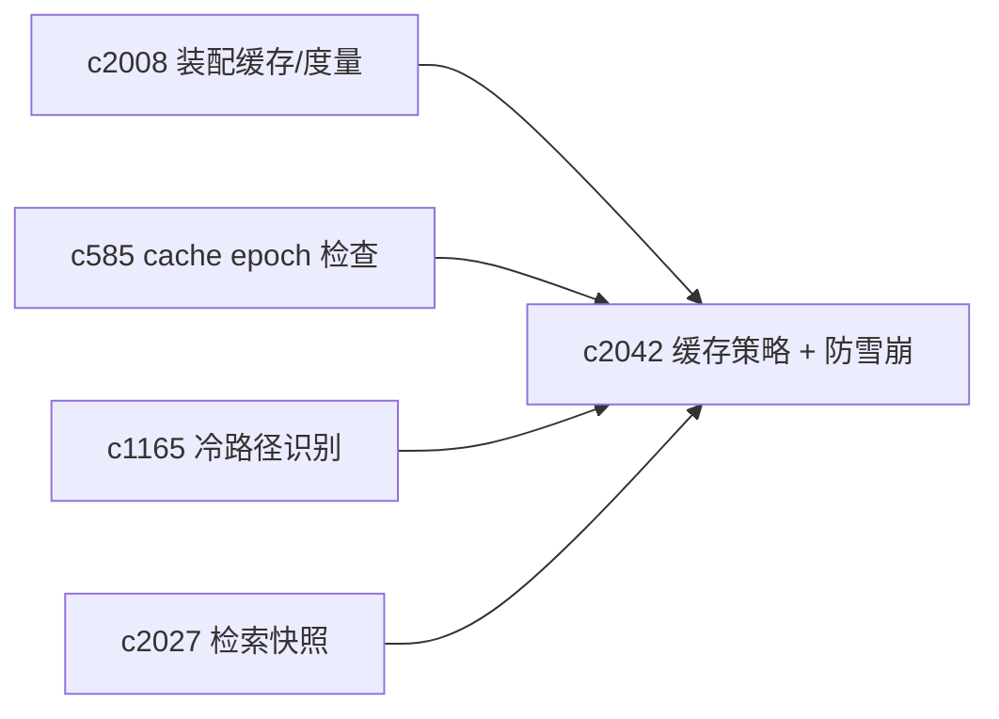
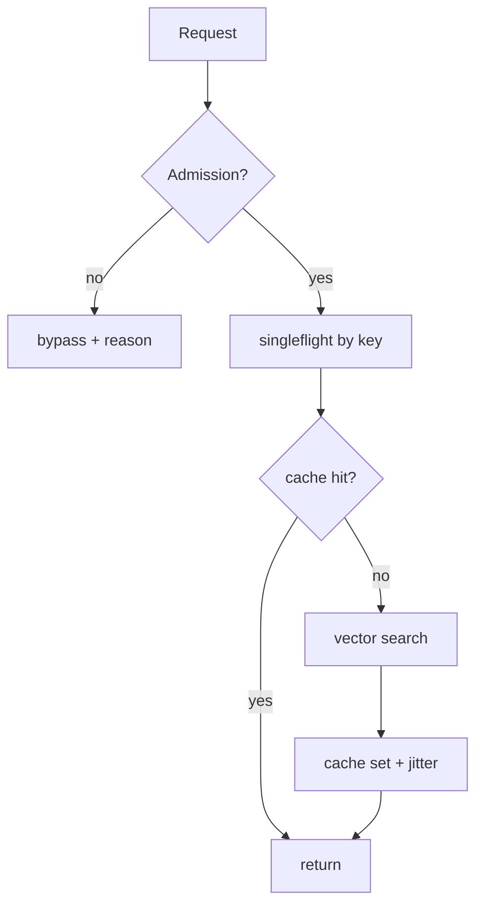

## Why

向量检索与装配现在已经有两层缓存：vector_search cache（短 TTL）和 retrieval assembly cache（更重但更省）。但如果没有统一的策略与防雪崩手段，缓存很容易带来“性能像玄学”：

- 热 key 同时过期，瞬间把向量库打爆（stampede）。
- 低价值请求也被缓存，占掉内存与 IO。
- 命中率、收益、失效原因看不清，只能凭感觉调 TTL。

我希望把缓存从“有就行”升级为“可控的性能层”：该缓存的缓存，不该缓存的直接 bypass，并且能解释原因。

## What Changes

- 定义 cache policy（至少覆盖向量检索与装配缓存）：
  - admission control：哪些请求不缓存（例如 source_ids 超大、top_k 极大、低命中模式）
  - TTL 分档：按 notebook 热度、请求类型调整
  - bypass_reason：写入 trace 与 metrics（对齐 `c2008`）
- 定义 stampede guards：
  - per-key singleflight（同一 key 同时只允许一个 miss 去打向量库）
  - soft TTL + jitter：避免齐刷刷过期
- 统一与 cache epoch/inspection 的关系：
  - policy 输出必须能被 `c585` 检查与预览消费
  - cold path detection（`c1165`）要能看到“为什么这里一直 bypass”

## Capabilities

### New Capabilities

- `vector-search-cache-policy-and-stampede-guards`: 定义向量检索缓存策略、admission 与防雪崩语义。

### Modified Capabilities

- `retrieval-context-assembly-cache-and-metrics`: 需要记录 bypass/收益。（`c2008`）
- `cache-epoch-inspection-and-invalidation-preview`: 需要覆盖 vector/search/assembly 关键域。（`c585`）
- `cache-coverage-maps-and-cold-path-detection`: 需要看到策略导致的冷路径。（`c1165`）
- `retrieval-snapshot-ids-and-deterministic-replay`: replay 需要记录缓存命中与否。（`c2027`）

## Impact

- Backend：需要把“缓存决策”做成显式逻辑，并记录到 metrics；同时实现单飞与 jitter。
- Frontend：诊断面能解释“为什么这次没用缓存”。
- Risk：singleflight 如果做不好会引入死锁/排队；所以需要明确超时与降级。

## Dependency Sketch

