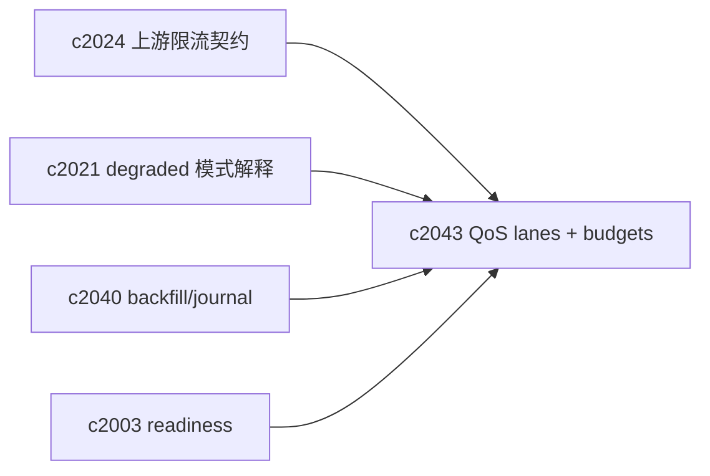
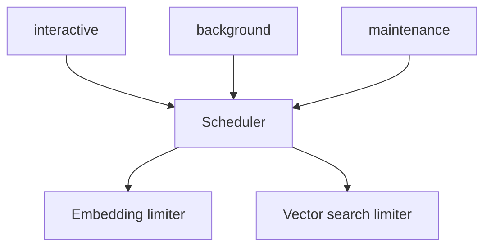

## Why

检索性能的“体感”经常被两类事情拖垮：

- 后台在做 backfill / migration，把 embedding 和向量检索资源吃满，前台对话突然变慢；
- 上游限流或 provider 抖动时，系统没有清晰的优先级，大家一起排队一起慢。

我们已经有 limiter，但 limiter 只控制并发，不表达“谁更重要”。我想加一层 QoS：把前台交互、后台回填、预热等动作分到不同优先级通道里，并能在 degraded 模式下给出解释。

## What Changes

- 定义 retrieval QoS lanes：
  - `interactive`：用户发起的 run/search（优先）
  - `background`：回填/迁移/预热（可延后）
  - `maintenance`：审计/清理（可暂停）
- 定义 budgets（按 notebook 或全局）：
  - embedding tokens/sec、vector search qps、最大排队时间
  - 超预算时的策略：降级、延后、拆批
- 与 degraded mode 对齐：
  - 当进入降级（例如 provider 不可用、限流严重），必须返回可读的 reason_code（对齐 `c2021`）
- 与上游限流契约对齐：
  - 遵循 `Retry-After`，把后台任务让路给交互请求（对齐 `c2024`）

## Capabilities

### New Capabilities

- `retrieval-qos-budgets-and-priority-lanes`: 定义检索 QoS、优先级通道与预算策略。

### Modified Capabilities

- `indexing-journal-and-resumable-backfills`: backfill 需要跑在 background lane。（`c2040`）
- `optional-services-readiness-contract`: provider 降级要能影响 lane 策略。（`c2003`）
- `profile-capability-matrix-and-degraded-mode-explainer`: UI 需要解释当前降级与 lane。（`c2021`）
- `upstream-rate-limit-handling-and-retry-after-contract`: 限流策略需要接入 QoS。（`c2024`）
- `request-context-and-correlation-ids`: lane 决策要可追踪。（`c2002`）

## Impact

- Backend：需要在 embedding/vector search 的 acquire 之前引入优先级调度；并把排队/降级写入 trace。
- Frontend：当变慢时，不是只看到 loading，而是知道“在排队/在降级/建议稍后重试”。
- Risk：优先级调度做不好会饿死后台任务；需要有最低保障与窗口。

## Dependency Sketch

