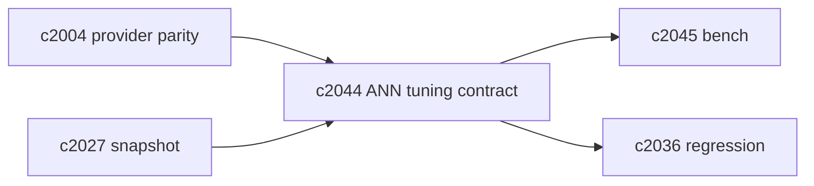
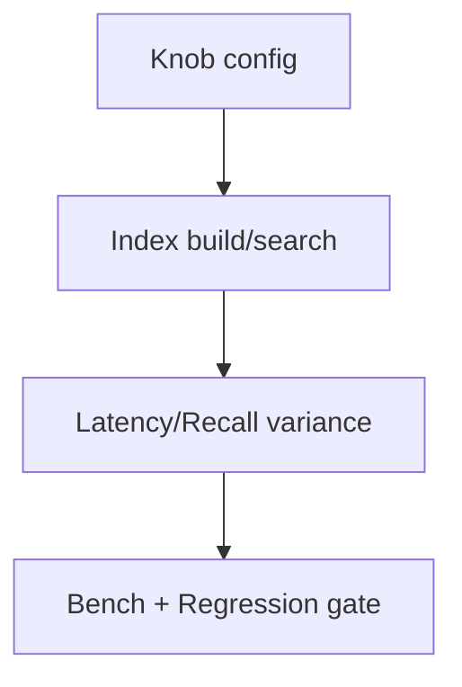

## Why

只要我们用的是近似索引（比如 HNSW），就绕不开一个事实：**性能、召回、稳定性三者需要取舍**。现在这些取舍大多藏在 provider 默认值里，导致：

- profile 切换后体验差异很大，但没人能说清楚“差在哪个参数”；
- 想优化性能，只能盲调，回归也无从评估。

我希望把 ANN 的调参做成契约：哪些 knob 存在、默认值是什么、调整会带来什么副作用，并且能被 bench / regression 消费。

## What Changes

- 定义 ANN tuning contract：
  - `knob_name`、范围、默认值、是否可在线修改
  - 对结果的影响声明：latency/recall/variance
  - provider capability flags：不支持就必须显式声明
- 定义 tuning snapshots：
  - `c2027` 的 retrieval_snapshot 附带 tuning 摘要
  - replay/回归时能复现同一 tuning 配置
- 定义 safety rails：
  - 不允许把高风险参数直接暴露给普通用户
  - 变更必须走 bench + 回归门禁（对齐 `c2045/c2036`）

## Capabilities

### New Capabilities

- `ann-index-tuning-contract-and-provider-knobs`: 定义 ANN 调参契约、tuning snapshot 与安全边界。

### Modified Capabilities

- `vector-store-contract-and-provider-parity`: 需要声明 ANN knobs。（`c2004`）
- `retrieval-snapshot-ids-and-deterministic-replay`: snapshot 需要携带 tuning 摘要。（`c2027`）
- `vector-store-benchmarks-and-profile-parity-reports`: bench 需要覆盖 knob 组合。（`c2045`）
- `retrieval-citation-regression-suite-and-quality-gates`: 回归需要吸收 ANN 变动。（`c2036`）

## Impact

- Backend：需要在 provider 层暴露 knob 并做配置治理；并把 tuning 纳入 trace/snapshot。
- Frontend：可以先不做 UI，只要诊断面能看到 tuning 摘要即可。
- Risk：如果 knob 变成随便改，会让结果不稳定；所以必须强制走门禁。

## Dependency Sketch

