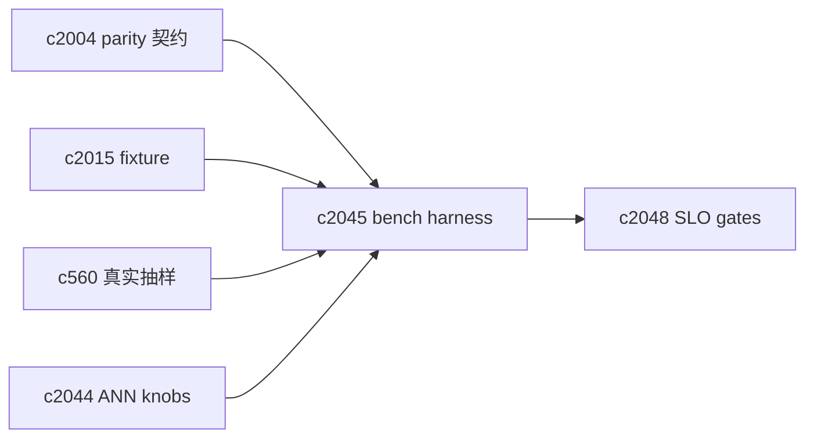
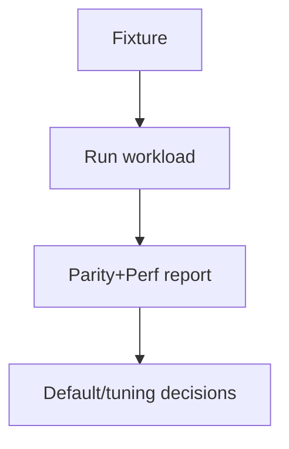

## Why

`c2004` 解决了“行为一致性”，但还差一块：**性能与成本**。我们目前同时有 memory/sqlite/chroma embedded/chroma http，这些 profile 的性能差异不只体现在向量检索，还包括：

- 写入吞吐（批量 upsert vs 单条写入）
- 索引构建时间（尤其是 backfill）
- 查询延迟分布（p95/p99）
- 近似索引带来的召回损失与波动

如果没有一个可重复的 benchmark，我们很难在不冒险的情况下做优化或切 provider。

## What Changes

- 定义 vector store benchmark harness：
  - fixture：真实 chunk 分布（可用 `c2015` fixture 或 `c560` 抽样）
  - workload：add/upsert/remove/search/search_many（覆盖常见 top_k/min_score/source_ids 组合）
  - metrics：build throughput、query p50/p95、cache hit、memory/disk 占用（能拿到就拿）
- 产出 profile parity report：
  - 不只列“谁快”，还要列“差异原因”：ANN tuning、网络 RTT、写放大
  - 建议默认 profile 与调参建议（不强绑实现）
- 与门禁对齐：
  - 关键变更（provider/knobs/embedding）必须至少跑一组最小 bench（对齐 `c2048`）

## Capabilities

### New Capabilities

- `vector-store-benchmarks-and-profile-parity-reports`: 定义向量存储 benchmark、workload 与性能对比报告。

### Modified Capabilities

- `vector-store-contract-and-provider-parity`: parity suite 可复用同一批 fixture。（`c2004`）
- `ingestion-trace-and-replay-fixtures`: fixture 需要能被 bench 消费。（`c2015`）
- `real-workspace-eval-dataset-capture-and-replay`: 可抽样真实分布做 bench。（`c560`）
- `ann-index-tuning-contract-and-provider-knobs`: bench 需要覆盖 knobs。（`c2044`）
- `retrieval-slo-metrics-and-drift-gates`: bench 结果需要进入门禁。（`c2048`）

## Impact

- Backend/DevEx：需要一个可一键跑的 bench runner + 报告格式；并明确“在 CI 跑什么，在本地跑什么”。
- Risk：bench 很容易做成“太重跑不动”；所以要区分 smoke bench 与 full bench。

## Dependency Sketch

