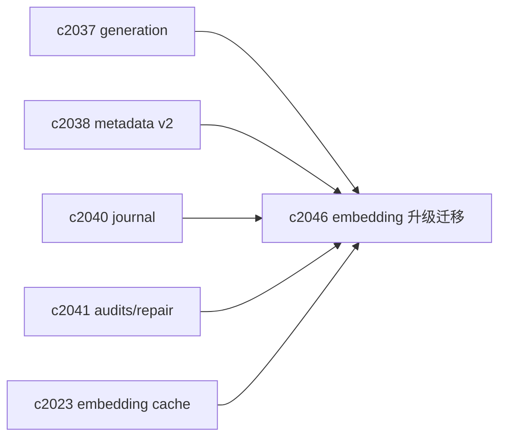
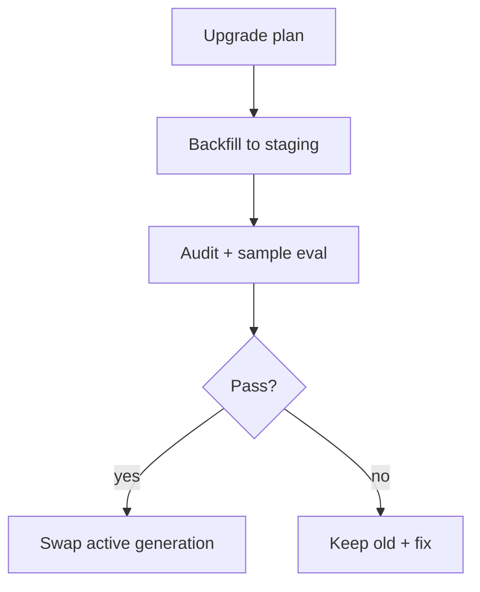

## Why

embedding 模型升级是检索质量提升的常规手段，但它几乎必然引入一次“索引大迁移”。如果迁移没被设计好，会出现很糟糕的中间态：

- 一半 source 是新向量，一半还是旧向量，结果质量和一致性都开始飘；
- 迁移跑到一半失败，恢复成本很高；
- 想回滚也回不了，因为旧索引已被覆盖。

我希望把 embedding 升级做成一个可回滚、可对账、可解释的流程，而不是一串手动操作。

## What Changes

- 定义 embedding upgrade plan：
  - 新模型 id、维度、预估成本与预计耗时
  - 迁移范围（全 notebook / 选定 sources）
  - 回滚策略（保留旧 generation 一段时间）
- 迁移执行采用 staging generation：
  - 写入新 generation（对齐 `c2037`）
  - 写入时带 metadata v2（对齐 `c2038`）
  - 完成后跑一致性审计（对齐 `c2041`）
  - 通过后再 swap
- 与缓存策略对齐：
  - embedding cache 要按 model_id 分桶（对齐 `c2023`）
  - 装配缓存/向量缓存要跟随 generation 失效（对齐 `c2042/c2008`）

## Capabilities

### New Capabilities

- `embedding-model-upgrades-and-safe-vector-migrations`: 定义 embedding 升级计划、staging 迁移与回滚边界。

### Modified Capabilities

- `vector-index-generation-ids-and-atomic-read-snapshots`: 迁移依赖 generation+swap。（`c2037`）
- `vector-entry-metadata-v2-and-drift-detection`: 迁移需要记录模型摘要。（`c2038`）
- `indexing-journal-and-resumable-backfills`: 迁移执行需要可续跑。（`c2040`）
- `vector-index-consistency-audits-and-repair-jobs`: swap 前后需要审计。（`c2041`）
- `embedding-cache-policy-and-visibility`: cache 分桶需要对齐 model_id。（`c2023`）

## Impact

- Backend：需要一套“迁移 orchestration + 版本对账”能力；并把中间态风险收敛到 staging。
- Frontend：可以在诊断面显示“正在迁移/预计完成/可回滚”，减少不确定感。
- Risk：迁移很重，必须和 QoS 结合，别把交互请求拖死（对齐 `c2043`）。

## Dependency Sketch

