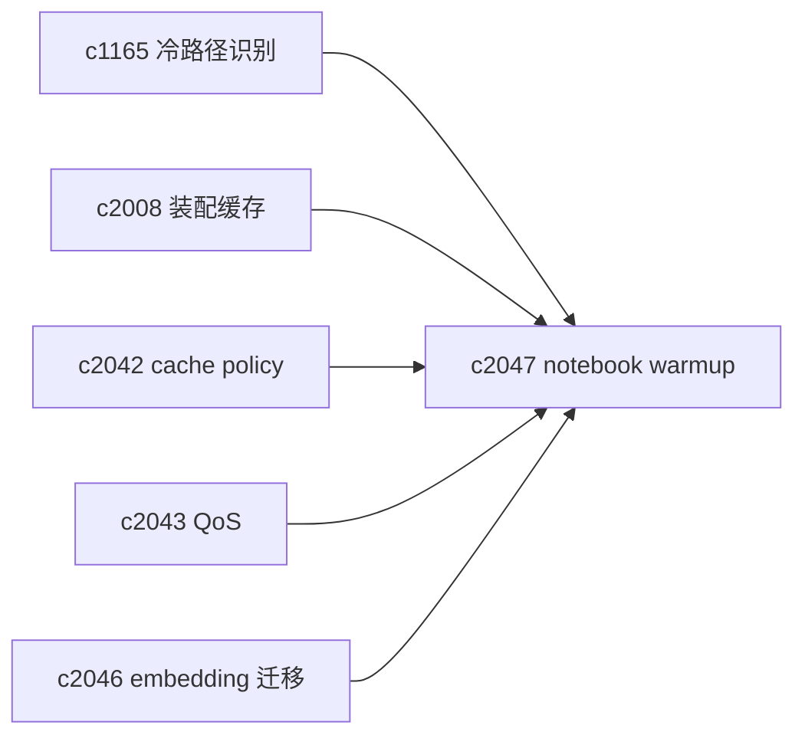
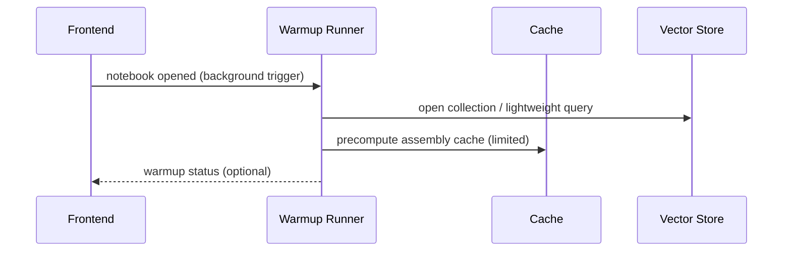

## Why

很多检索慢不是“算法慢”，而是“冷启动慢”：第一次打开 notebook、第一次跑检索、第一次生成 output，总会撞到一堆冷路径（embedding 冷、向量库冷、装配缓存空、DB page cache 空）。

我们已经能做缓存覆盖分析（`c1165`）和装配缓存（`c2008`），但还缺一个面向体感的策略：对活跃 notebook 做预热，把用户的第一次等待缩短到可接受范围。

## What Changes

- 定义 warmup targets（只做少量、可控的预热）：
  - 预热向量库连接/collection（避免第一次 query 才建连接）
  - 预热 retrieval assembly cache 的常用模板（可用 `c2036` 的 golden query 子集）
  - 预热 citation context 的基础窗口（对齐 `c2034`，可选）
- 定义 warmup triggers：
  - notebook 打开、sources 更新完成、embedding 升级 swap 后（对齐 `c2046`）
  - 以 QoS background lane 执行（对齐 `c2043`）
- 定义 warmup guardrails：
  - 有预算上限与退避策略，避免把系统预热到过载
  - 记录 warmup 命中收益，接回冷路径识别（`c1165`）

## Capabilities

### New Capabilities

- `hot-notebook-warmup-and-cache-precompute`: 定义热工作区预热目标、触发与保护策略。

### Modified Capabilities

- `cache-coverage-maps-and-cold-path-detection`: warmup 需要回写覆盖收益。（`c1165`）
- `retrieval-context-assembly-cache-and-metrics`: 预热需要复用装配缓存策略。（`c2008`）
- `vector-search-cache-policy-and-stampede-guards`: warmup 需要尊重 admission。（`c2042`）
- `retrieval-qos-budgets-and-priority-lanes`: warmup 只能跑在 background lane。（`c2043`）
- `embedding-model-upgrades-and-safe-vector-migrations`: swap 后需要 warmup。（`c2046`）

## Impact

- Backend：需要 warmup runner 与预算；并把 warmup 当作“可关可量化”的后台任务。
- Frontend：可以只在诊断面提示 warmup 状态，不强制做复杂 UI。
- Risk：预热如果不受控，会变成“后台永远在跑”；所以预算与退避必须写死。

## Dependency Sketch

