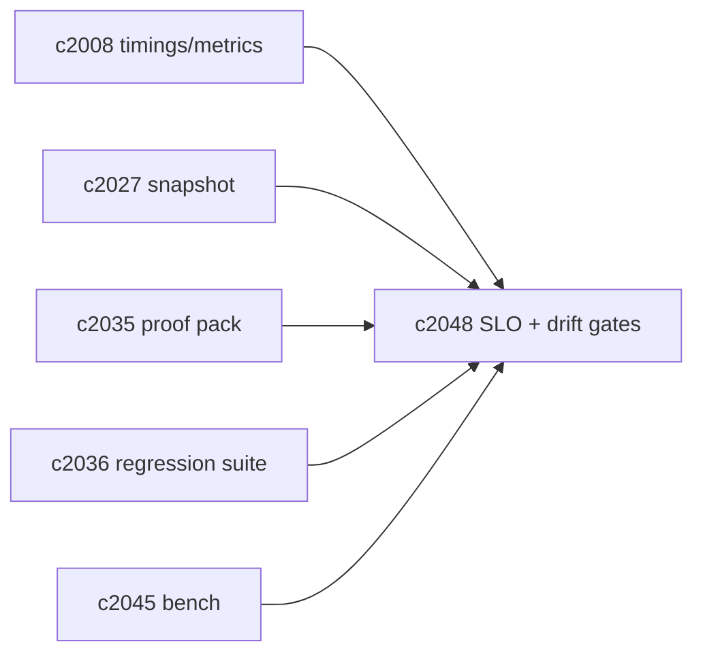
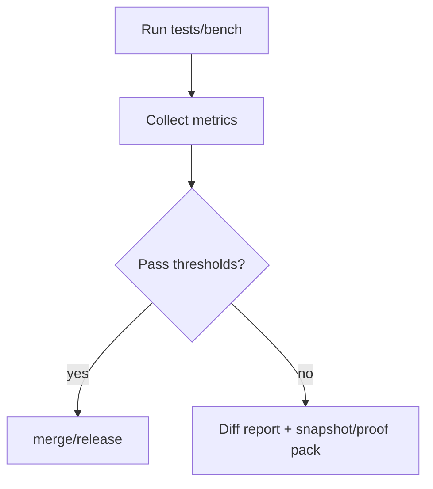

## Why

检索性能和一致性如果不做门禁，最后一定会“慢慢变差”：某次改动多花了 80ms，看起来不痛不痒，几周后 p95 变成 2 秒；某次 provider 调参让结果更抖，大家只能靠体感吵。

我们已经在检索装配里采了 timings，也在提案里做了回归与 bench（`c2036/c2045`）。这条变更想把它们串成一个可执行的护栏：**SLO 指标 + 漂移门禁**。

## What Changes

- 定义 retrieval SLO 指标（分 profile/provider/notebook）：
  - embedding p95、vector_search p95、db p95、format p95、total p95
  - cache hit rate（vector / assembly）
  - drift 指标：generation mismatch、vector drift rate（对齐 `c2038/c2041`）
- 定义 drift gates：
  - 性能回退阈值（例如 p95 +20% 直接 fail）
  - 一致性阈值（低置信度/漂移率突然升高直接 fail）
  - 失败必须产出可读 diff（对齐 `c2027/c2035` 的 snapshot/proof pack）
- 明确运行分层：
  - CI 跑最小门禁（小样本 + 关键指标）
  - 本地/夜间跑完整 bench + 回归

## Capabilities

### New Capabilities

- `retrieval-slo-metrics-and-drift-gates`: 定义检索 SLO、漂移指标与门禁规则。

### Modified Capabilities

- `retrieval-citation-regression-suite-and-quality-gates`: 回归结果需要接入门禁。（`c2036`）
- `vector-store-benchmarks-and-profile-parity-reports`: bench 结果需要接入门禁。（`c2045`）
- `retrieval-context-assembly-cache-and-metrics`: 需要稳定输出 timings/metrics。（`c2008`）
- `retrieval-snapshot-ids-and-deterministic-replay`: 失败报告需要 snapshot。（`c2027`）
- `retrieval-proof-packs-and-evidence-bug-reports`: 失败样本可用 proof pack 固化。（`c2035`）

## Impact

- Backend/DevEx：需要一套门禁 runner 与报告输出；把“性能/一致性退化”变成可阻断事件。
- Risk：门禁设得太死会卡住迭代；所以要先抓关键指标，再逐步加严。

## Dependency Sketch

