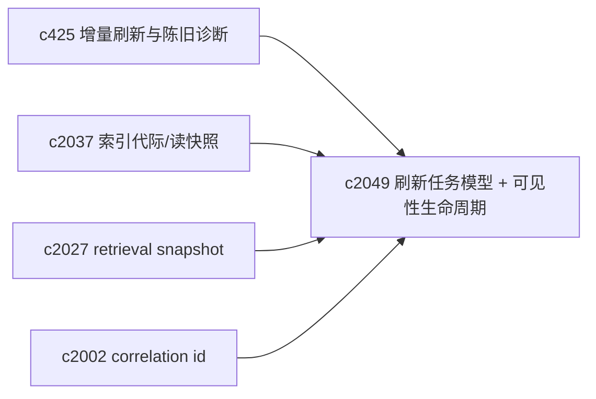
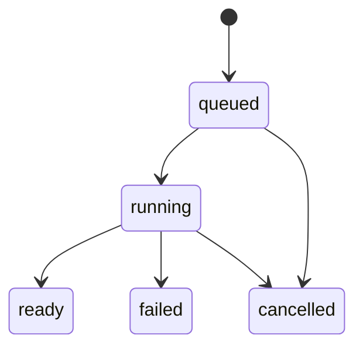

## Why

目前“索引刷新”在系统里更像一组隐式副作用：来源进来了、向量写了、epoch bump 了、缓存失效了——但用户真正关心的那件事没被说清楚：**我刚加的内容，什么时候能被搜到？被谁搜到？如果还搜不到，是因为在排队、在重建、还是失败了？**

`c425` 已经提出增量刷新与陈旧诊断，但如果没有统一的“刷新任务模型 + 可见性生命周期”，最后很容易演变成：

- 每个索引域各玩各的状态机；
- 前端只能显示一个笼统的 loading；
- 回放（`c2027`）和一致性读（`c2037`）也很难落地。

这条提案想先把最核心的语义钉住：**刷新任务是什么、状态是什么、以及它对读取可见性的影响是什么**。

## What Changes

- 定义 `IndexDomain`（索引域）与最小集合（可扩展）：
  - `sources_meta`（来源元数据/标签）
  - `chunks`（切块结果）
  - `vector`（向量索引）
  - `lexical`（字面/倒排索引，如果启用 `c2030`）
  - `outputs`（产物索引/引用索引等，视实现而定）
- 定义 `IndexRefreshJob`（刷新任务）：
  - `job_id`、`domain`、`scope`（notebook/source）、`trigger`、`requested_at/started_at/finished_at`
  - `state`：`queued/running/ready/failed/cancelled`
  - `progress`（可选）：stage + counters + eta（详细在 `c2054`）
  - `target_generation_id`（对齐 `c2037`：写 staging/切换 active）
  - `correlation_id`（对齐 `c2002`）
- 定义 `IndexVisibility`（可见性生命周期，回答“读的时候看到什么”）：
  - 默认：读 `active_generation`（强一致读快照，对齐 `c2037`）
  - 如果某域在刷新中：返回 `staleness` 信息（对齐 `c425`），并说明是否会影响当前请求
  - 明确“允许部分可见”的场景（例如只刷新 sources_meta 不影响向量检索）
- 对外暴露最小诊断面：
  - “这个 notebook 在哪些域上是 stale/refreshing”
  - “最新刷新任务列表（最近 N 条）”

## Capabilities

### New Capabilities

- `index-refresh-job-model-and-visibility-lifecycle`: 定义索引域、刷新任务模型与可见性生命周期。

### Modified Capabilities

- `search-index-incremental-refresh-and-staleness-diagnostics`: staleness 需要落到 job+domain 语义。（`c425`）
- `vector-index-generation-ids-and-atomic-read-snapshots`: 可见性默认应绑定 active generation。（`c2037`）
- `retrieval-snapshot-ids-and-deterministic-replay`: snapshot 需要能指向对应的索引可见性。（`c2027`）
- `request-context-and-correlation-ids`: 刷新任务必须串得回请求与日志。（`c2002`）

## Impact

- Backend：需要统一的 job 数据结构/存储与状态更新入口；并且把“可见性”从实现细节提升为契约。
- Frontend：不要求立刻做复杂 UI，但至少能把“在刷新/已失败/已就绪”讲明白。
- Risk：状态机如果设计得太花，会把团队拖进维护泥潭；所以第一版要克制，先覆盖最常见路径。

## Dependency Sketch

