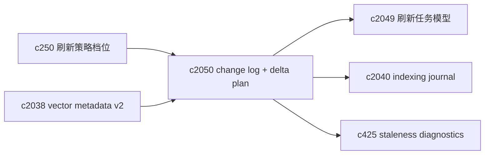
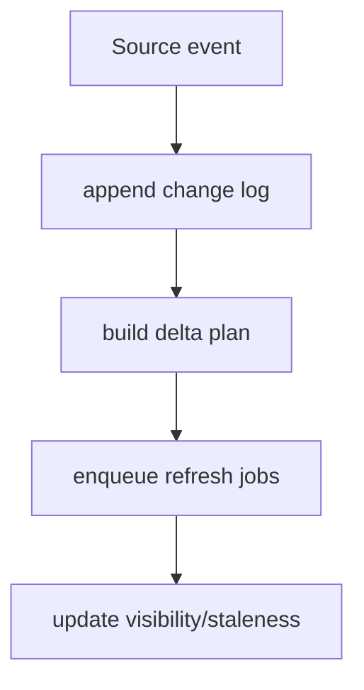

## Why

刷新做得粗一点，系统就会“总在重建”；做得细一点，系统就会“总在漏更新”。现在缺的不是更多开关，而是一份明确的事实记录：**来源到底发生了什么变化**。

如果我们能把“变化”落成 change log，就能做三件事：

- 增量刷新真正变成“算得出来的计划”，而不是一堆 if/else。
- 队列能合并重复工作（同一个 source 连续刷新 3 次，最后只跑一次真正的重建）。
- staleness diagnostics 能说人话：不是“可能旧”，而是“旧在标题/旧在正文/旧在向量”。

## What Changes

- 定义 `SourceChangeLog`（来源变化日志）：
  - `source_id`、`change_id`、`change_type`（content/meta/tags/delete）
  - `content_hash_before/after`、`chunking_version`、`parser_version`
  - `embedding_model_id`（如果涉及向量）
  - `created_at`、`correlation_id`（对齐 `c2002`）
- 定义 `DeltaIndexingPlan`（增量刷新计划）：
  - 输入：一段时间窗口内的 change log（可合并）
  - 输出：要刷新哪些 `IndexDomain`、scope 是 source 级还是 notebook 级、是否需要 staging generation
  - 合并规则：meta/tags 变化不应触发向量重建；content 变化才触发 chunks+vector+lexical
- 计划落盘并链接到 indexing journal（对齐 `c2040`），成为可审计对象（对齐 `c2041`）。

## Capabilities

### New Capabilities

- `source-change-log-and-delta-indexing-planner`: 定义 change log、增量刷新计划与合并规则。

### Modified Capabilities

- `source-refresh-policy-profiles-and-auto-recheck`: auto recheck 需要写 change log。（`c250`）
- `index-refresh-job-model-and-visibility-lifecycle`: refresh job 的 trigger/plan 需要标准化。（`c2049`）
- `indexing-journal-and-resumable-backfills`: plan/journal 需要互相链接。（`c2040`）
- `vector-entry-metadata-v2-and-drift-detection`: drift 与 content_hash/chunk_hash 需要对齐。（`c2038`）
- `search-index-incremental-refresh-and-staleness-diagnostics`: staleness 原因应能回指 change log。（`c425`）

## Impact

- Backend：需要补 change log 存储与 planner；并把“刷新触发点”从散落代码收敛到统一入口。
- Frontend：诊断面能明确显示“这次刷新只改了元数据/还是正文变了”，减少猜。
- Risk：hash/version 字段如果不稳，会误判变化；所以要明确 SSOT（以解析后的标准化文本为准）。

## Dependency Sketch

