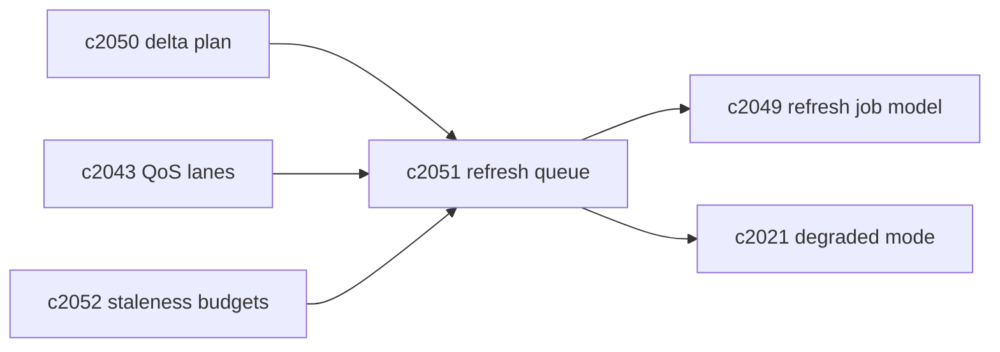
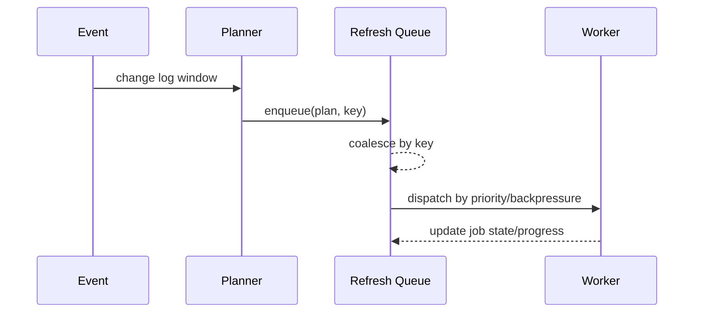

## Why

只要索引刷新开始变得“正确”（更细粒度、更频繁），队列就会立刻成为瓶颈：任务多、重复多、还会互相抢资源。

如果没有一条像样的队列策略，系统会出现很典型的坏味道：

- 刷新任务堆积，staleness 永远在红线附近；
- 同一个 scope 被重复刷新，浪费向量/embedding 配额；
- 后台 backfill 把前台交互拖慢，用户只感受到“越来越卡”。

这条提案的目标很朴素：把 refresh queue 从“能跑”变成“能控、能解释、不会自杀式放大”。

## What Changes

- 定义 refresh queue 语义：
  - key：`(notebook_id, domain, scope)`；同 key 的任务必须可 coalesce
  - 合并规则：新 plan 覆盖旧 plan；保留最早触发时间与原因列表
  - 幂等：job 必须有 idempotency key（对齐 `c2055`）
- 定义 backpressure：
  - backlog 超阈值时，自动降低 auto recheck 频率（对齐 `c250`）
  - 降级模式：明确告诉用户“正在排队/系统限流/建议稍后重试”（对齐 `c2021`）
- 定义 fairness / priority：
  - interactive lane 优先（对齐 `c2043`）
  - 同 notebook 内按“staleness 风险”排序（对齐 `c2052`）
  - maintenance/audit 可被暂停（对齐 `c2041`）

## Capabilities

### New Capabilities

- `refresh-queue-coalescing-backpressure-and-fairness`: 定义刷新队列合并、背压与公平调度。

### Modified Capabilities

- `index-refresh-job-model-and-visibility-lifecycle`: job 状态需要能反映排队/合并。（`c2049`）
- `source-change-log-and-delta-indexing-planner`: plan 是队列的主要输入。（`c2050`）
- `retrieval-qos-budgets-and-priority-lanes`: lane 策略需要覆盖 refresh。（`c2043`）
- `profile-capability-matrix-and-degraded-mode-explainer`: 降级解释要能覆盖 backlog。（`c2021`）

## Impact

- Backend：需要真正的队列抽象（哪怕第一版落在 DB 表+轮询），并把合并/背压做成显式逻辑。
- Frontend：诊断面至少能看到“你这次刷新在排队，以及排在谁后面”（不用很精确，但要诚实）。
- Risk：合并逻辑如果写错，会“越合越乱”；必须把合并规则写进契约与测试。

## Dependency Sketch

