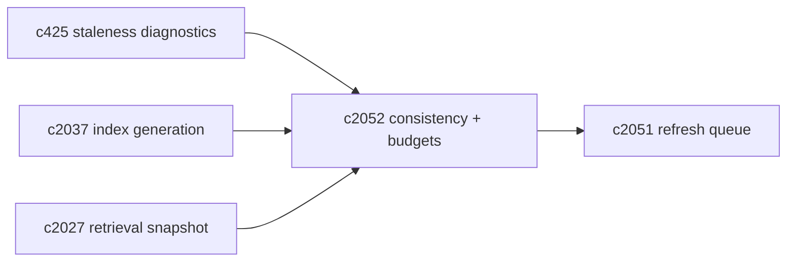
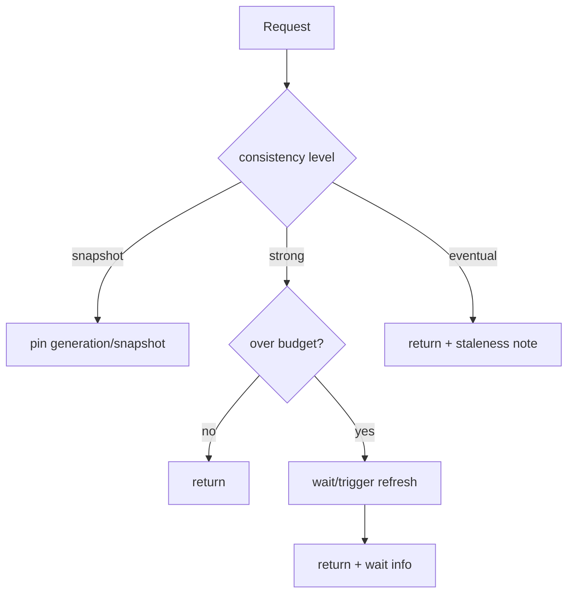

## Why

“索引可能是旧的”这句话对用户没有帮助。真正需要被表达的是：**你这次读取想要多“新”？为了新要付出多大代价？如果不够新，会怎么影响结果？**

我们已经有 staleness diagnostics（`c425`）和读快照（`c2037`）的方向，但还缺一层更靠近产品语义的契约：一致性级别与 staleness 预算。

有了它，系统才能做出合理选择：

- 有些请求应该立刻返回（即使略旧），并把风险讲清楚；
- 有些请求必须等索引追上来（read-after-write），否则就是误导。

## What Changes

- 定义 `ReadConsistencyLevel`：
  - `strong`：要求覆盖最新 change log（可能等待 refresh job 完成）
  - `snapshot`：固定到某个 `index_generation_id`（对齐 `c2037`）/ `snapshot_id`（对齐 `c2027`）
  - `eventual`：允许返回旧索引，但必须返回 staleness 解释与建议动作
- 定义 `StalenessBudget`（按 notebook/domain）：
  - `max_age_s`（例如向量索引最多落后 10 分钟）
  - `max_changes`（最多落后 N 次变更）
  - 超预算时的策略：wait / degrade / partial（对齐 `c2056` 的查询规划）
- lens/模式如何选择 consistency：
  - 证据核查/引用修复倾向 `strong`
  - 探索性搜索倾向 `eventual`
  - 回放/回归倾向 `snapshot`

## Capabilities

### New Capabilities

- `consistency-levels-staleness-budgets-and-read-policies`: 定义一致性级别、staleness 预算与选择规则。

### Modified Capabilities

- `search-index-incremental-refresh-and-staleness-diagnostics`: staleness 需要按 domain+budget 解释。（`c425`）
- `vector-index-generation-ids-and-atomic-read-snapshots`: snapshot 需要能 pin generation。（`c2037`）
- `retrieval-snapshot-ids-and-deterministic-replay`: 回放需要明确 consistency。（`c2027`）
- `refresh-queue-coalescing-backpressure-and-fairness`: 优先级需要考虑 budget 风险。（`c2051`）

## Impact

- Backend：需要把“等待/不等待”的决策逻辑做成显式策略，并把选择写进 trace。
- Frontend：不要求给用户很多开关，但至少在 debug/诊断面可以看见 consistency 与 budget。
- Risk：如果强一致默认开，会把系统拖慢；所以要清楚默认值与适用场景。

## Dependency Sketch

