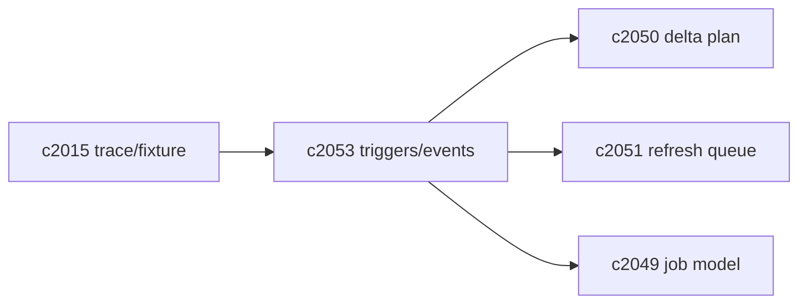
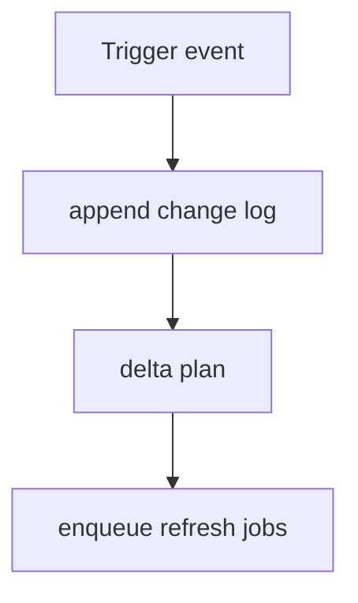

## Why

增量刷新要可靠，必须先回答一个基本问题：**哪些事件会让哪些索引域变旧？**

现在系统里有很多“变化源”：

- ingestion 成功/失败、auto recheck、手动 re-embed；
- 解析器/切块策略升级；
- embedding 模型升级（`c2046`）或 provider 切换（`c2004`）；
- 标签/状态变化影响过滤与排序。

如果没有统一的触发器契约，刷新策略只能散落在各处：某个路径忘了触发 refresh，staleness 就变成随机故障。

## What Changes

- 定义 `RefreshTriggerEvent`（事件钩子）：
  - `event_type`：source_ingested/source_refreshed/source_deleted/tags_changed/chunking_changed/embedding_changed/provider_changed
  - `scope`：notebook_id + optional source_id
  - `versions`：parser_version/chunking_version/embedding_model_id/index_generation_id（可选）
  - `correlation_id`（对齐 `c2002`）
- 定义 `Event->Domain` 映射表（最小必需）：
  - content 变化 → chunks/vector/lexical
  - meta/tags 变化 → sources_meta/filters
  - embedding/provider 变化 → vector（通常需要 staging generation）
- 定义 event delivery 语义：
  - 至少一次投递（允许重复），必须幂等（对齐 `c2055`）
  - 支持 outbox/重放（对齐 `c2015` 的 trace/fixture）
- planner（`c2050`）消费事件与 change log，生成 delta plan。

## Capabilities

### New Capabilities

- `refresh-trigger-contracts-and-event-hooks`: 定义刷新触发事件、域映射与投递/重放语义。

### Modified Capabilities

- `ingestion-trace-and-replay-fixtures`: trace/fixture 需要覆盖触发事件。（`c2015`）
- `source-change-log-and-delta-indexing-planner`: planner 需要消费事件。（`c2050`）
- `refresh-queue-coalescing-backpressure-and-fairness`: queue 需要按事件合并。（`c2051`）
- `index-refresh-job-model-and-visibility-lifecycle`: job 需要记录 trigger。（`c2049`）

## Impact

- Backend：需要统一事件结构与投递入口，避免各模块各写一套“刷新逻辑”。
- Frontend：不强制 UI 暴露事件，但诊断面可以用事件解释“为什么开始刷新”。
- Risk：事件如果太细会淹没队列；所以必须搭配 coalesce（`c2051`）与预算（`c2052`）。

## Dependency Sketch

