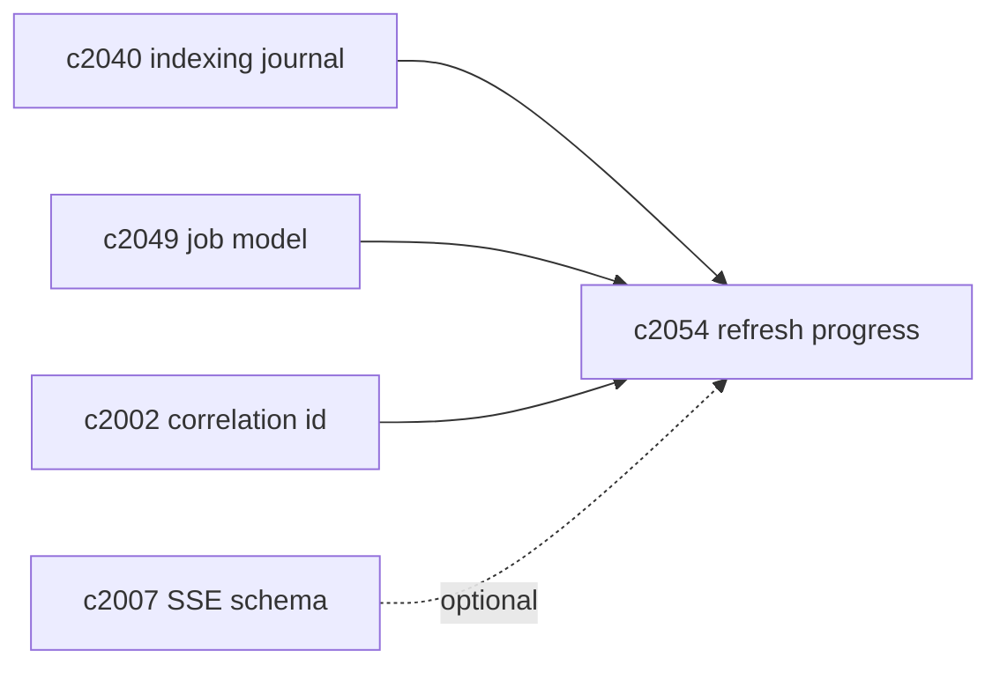
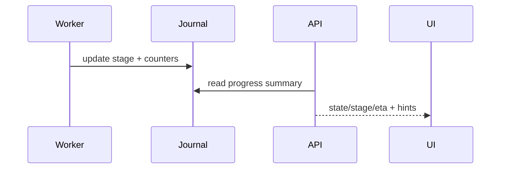

## Why

刷新队列再聪明，如果用户和开发者看不见进度，体感还是会很差：你只看到“还没好”，但不知道是在排队、在 embedding、在写索引，还是早就失败了。

我们已经有长任务可恢复（`c2001`）、correlation id（`c2002`）和 ingestion trace（`c2015`）的基础。这里想补的是更贴近“刷新”这一类任务的进度摘要，让它能被 UI 和排障直接消费。

## What Changes

- 定义 `RefreshProgressSummary`（按 job）：
  - `state`、`stage`（parse/chunk/embed/upsert/verify/swap）
  - counters：`sources_total/sources_done`、`chunks_total/chunks_done`（能拿到就拿）
  - `eta_s`（估算，可选）
  - `last_error` + `recovery_hint`
  - `visibility_hint`：当前哪些域仍 stale，会影响哪些读请求（对齐 `c2049`）
- 定义“最小可见诊断面”（API/事件）：
  - 获取 notebook 的 refresh 状态摘要（最近 N 个 job + staleness 概览）
  - SSE 推送进度（可选，对齐 `c2007`）
- 与 indexing journal 对齐：summary 字段必须能回指 journal 记录（对齐 `c2040`）。

## Capabilities

### New Capabilities

- `refresh-progress-summaries-and-user-facing-diagnostics`: 定义刷新进度摘要、错误提示与可见诊断面。

### Modified Capabilities

- `index-refresh-job-model-and-visibility-lifecycle`: job 需要承载 progress。（`c2049`）
- `indexing-journal-and-resumable-backfills`: 进度来自 journal stage。（`c2040`）
- `task-runtime-durability-and-restart-reconciliation`: 重启恢复需要保持进度一致。（`c2001`）
- `request-context-and-correlation-ids`: 进度更新要串到同一次操作。（`c2002`）
- `sse-event-schema-and-stream-client`: 可选的进度推送需要事件 schema。（`c2007`）

## Impact

- Backend：需要把 stage/counters 采出来并稳定输出（即使是估算，也要可重复）。
- Frontend：能把“刷新中/排队/失败”呈现得更真实，减少无意义的重试。
- Risk：进度如果经常跳来跳去会更烦；所以要宁可保守，不要演戏式百分比。

## Dependency Sketch

