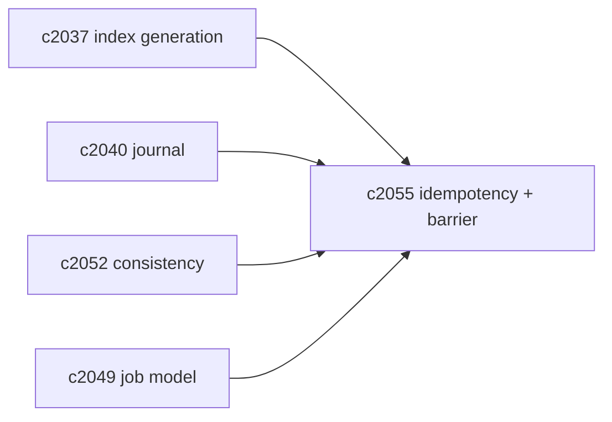
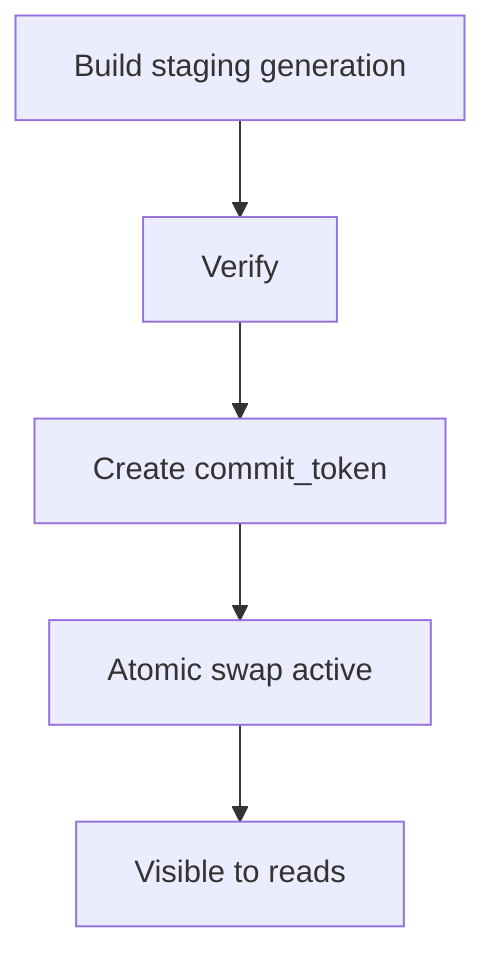

## Why

刷新链路里最难的一类 bug，是“半成功”：写了一部分、读到了混合态、然后结果变得不可解释。

`c2037` 已经把“读快照/索引代际”作为底座，但要把它真正用起来，还需要更明确的两个契约：

1) **幂等**：同一个刷新任务重复跑，不应该把索引越跑越脏。
2) **写屏障（write barrier）**：读请求什么时候可以看到新索引，必须有一个明确的“提交点”。

## What Changes

- 定义 indexing idempotency：
  - 每个 refresh job 必须有 `idempotency_key`（由 scope+plan digest 推导）
  - worker 必须能识别“已完成/已部分完成”的 job，并安全跳过或续跑（对齐 `c2040`）
- 定义 write barrier / commit token：
  - `staging_generation` 完成后产出 `commit_token`
  - 只有当 commit_token 被标记为 active，读请求才允许切换到新 generation（对齐 `c2037`）
  - `strong` consistency（`c2052`）可以等待某个 commit_token 达成
- 明确 partial visibility 的边界：
  - 默认不允许向量域 partial visible（避免混合 embedding）
  - 允许 sources_meta 域 partial visible（风险更小）

## Capabilities

### New Capabilities

- `indexing-idempotency-and-write-barrier-contract`: 定义幂等键、写屏障与提交点语义。

### Modified Capabilities

- `vector-index-generation-ids-and-atomic-read-snapshots`: barrier 必须围绕 generation swap。（`c2037`）
- `indexing-journal-and-resumable-backfills`: 幂等/续跑需要 journal。（`c2040`）
- `consistency-levels-staleness-budgets-and-read-policies`: strong consistency 需要可等待提交点。（`c2052`）
- `index-refresh-job-model-and-visibility-lifecycle`: job 状态需要包含 commit 信息。（`c2049`）

## Impact

- Backend：需要把“刷新完成”定义为可验证的提交点，不再靠“函数跑完了”。
- Frontend：诊断面能解释“为什么你看不到新内容：因为还没过写屏障”。
- Risk：提交点如果定义得太严，会拖慢可见性；所以要按 domain 分层。

## Dependency Sketch

