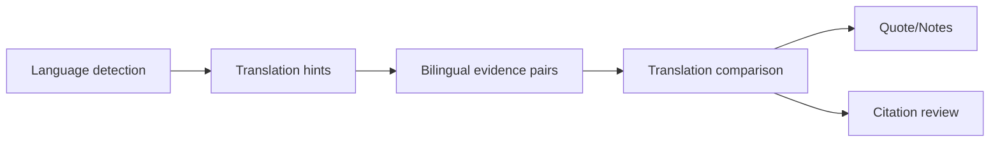

## Why

来源一旦跨语言，问题不只是看不懂，还会影响引用、搜索和后续生成：同一段证据在不同语言里的表达差异，可能直接改变结论强度。现在如果系统不先把语言信号立起来，多语言材料会一直像“能导入，但不好用”。

更进一步，用户既想快速理解，也怕翻译把关键语气和细节磨平。除了“提示我需要翻译”，还需要一个稳定的“双语对照证据面”：让原文与译文成对出现，可比较、可引用、可追溯。

## What Changes

- 定义 source language detection：
  - 为来源与片段补稳定语言标记（source-level + segment/chunk-level）
  - 语言信号回流到搜索过滤、rerank 与后续生成装配
- 增加 translation hints（提示而非产物）：
  - 说明哪些来源需要翻译/双语处理
  - 区分自动翻译建议与正式翻译产物，避免把提示和转换混为一谈
- 定义 bilingual evidence pair：
  - 把原文片段和译文片段稳定配对，形成可追溯的双轨证据
  - 区分“阅读辅助翻译”和“可直接引用翻译”，明确边界
- 增加 translation comparison：
  - 标记可能影响理解的措辞差异与不确定翻译点
  - 支持双语对照进入摘录、引用 hover/sidecar 与审读/复核模式

## Capabilities

### New Capabilities
- `source-language-detection-and-translation-hints`: 来源语言识别、翻译提示与跨语言处理边界。
- `translation-comparison-and-bilingual-evidence-pairs`: 双语证据配对、译文差异提示与引用边界。

### Modified Capabilities
- `source-ingestion-core`: 接入阶段补语言标记，并为后续片段级配对预留元数据。
- `unified-search-query-and-rerank`: 搜索/筛选/排序消费语言信号与翻译提示。
- `quote-clipping-and-note-weaving`: 摘录保留原文与译文双轨，并能携带 comparison 提示。
- `inline-citation-review-queue-and-fix-sweeps`（`c2034`）：引用复核识别译文是否可追溯回原文。
- `audio-video-briefings`: 多模态输出知道来源语言与处理建议（例如是否需要配字幕/译文 sidecar）。

## Impact

- Backend：语言检测、片段级翻译绑定、bilingual pair 存储与锚点、comparison 输出字段。
- Frontend：来源阅读器/摘录面板/引用复核视图支持双语对照与差异提示；搜索过滤展示语言与翻译提示。
- Dependencies：这条线承接 `c1009`（含接入异常与可疑内容标记），并建议与 `c2093`/`c2034` 的证据审阅与引用复核闭环对齐。

