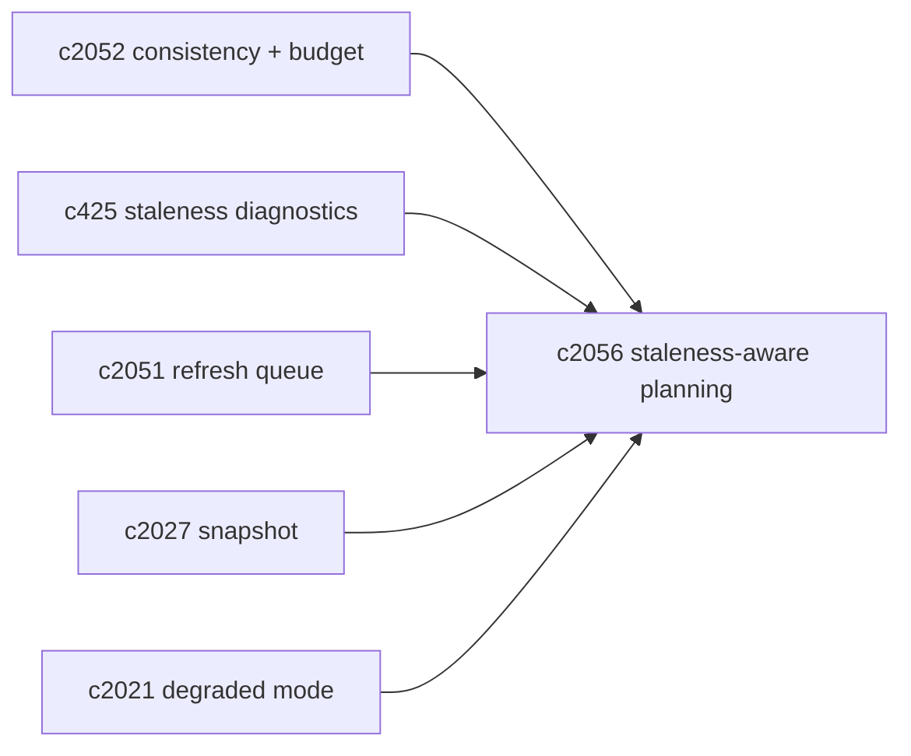
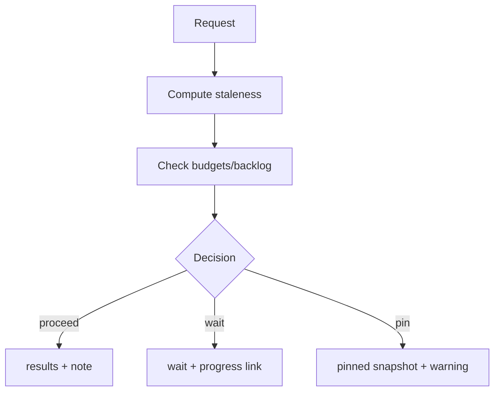

## Why

把 staleness 算出来只是第一步。真正决定体验的是：系统拿到 staleness 之后怎么做选择，并且能不能把选择讲清楚。

同一个请求，在不同场景下合理行为完全不同：

- 你刚刷新完来源，马上发起一次“证据核查”，这时候旧索引是不能接受的；
- 你只是探索性搜一下，旧一点没关系，但要告诉你旧在哪里。

如果 query planner 不 staleness-aware，用户最终会得到两种糟糕体验：要么被莫名其妙地等住，要么被悄悄喂了旧结果。

## What Changes

- 定义 staleness-aware query planning：
  - 输入：`consistency level`（`c2052`）+ domain staleness（`c425`）+ backlog 状态（`c2051`）
  - 输出：
    - `plan_action`：proceed / wait_for_refresh / trigger_refresh_and_proceed / pin_snapshot
    - `explain`：简短、可读、可落地的原因与建议
- 定义标准化 `staleness_reason_code`：
  - `REFRESH_IN_PROGRESS`、`BACKLOG_HIGH`、`REFRESH_FAILED`、`PROVIDER_DEGRADED`、`BUDGET_EXCEEDED`
- 定义用户可执行的恢复动作（只定义契约，不强制 UI）：
  - `refresh_now`、`retry_with_eventual`、`pin_snapshot`、`open_refresh_status`

## Capabilities

### New Capabilities

- `staleness-aware-query-planning-and-result-explanations`: 定义 staleness-aware 规划、原因码与恢复动作。

### Modified Capabilities

- `consistency-levels-staleness-budgets-and-read-policies`: 规划需要消费 consistency/budget。（`c2052`）
- `refresh-queue-coalescing-backpressure-and-fairness`: backlog/priority 影响规划。（`c2051`）
- `search-index-incremental-refresh-and-staleness-diagnostics`: staleness 必须能产出 reason_code。（`c425`）
- `profile-capability-matrix-and-degraded-mode-explainer`: provider 降级需要可解释。（`c2021`）
- `retrieval-snapshot-ids-and-deterministic-replay`: pin_snapshot 需要可回放。（`c2027`）

## Impact

- Backend：需要把“等待/触发刷新/固定快照”的决策抽成明确策略，并写进 trace，便于回归与调参。
- Frontend：即使不做复杂交互，也能把“为什么旧/为什么要等”说清楚，减少猜疑。
- Risk：规划如果经常摇摆，会让用户更不信；所以策略要稳定、阈值要透明。

## Dependency Sketch

