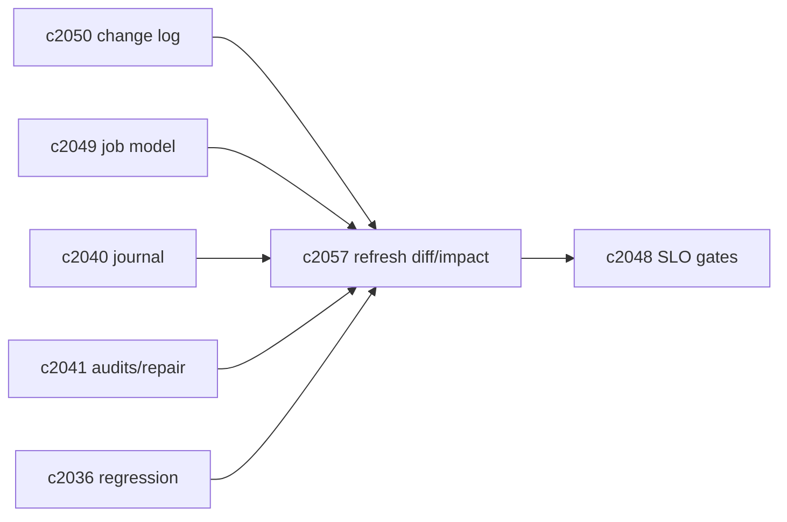

## Why

刷新跑完了不代表问题结束。我们还需要知道两件事：

1) **到底改了什么**（这次 refresh 影响了哪些 sources、哪些 chunks、哪些索引域）
2) **改动有没有把系统搞坏**（性能变慢、结果更抖、引用更薄）

如果没有 refresh diff 与影响报告，回归门禁只能盯“输出结果”，一旦退化很难定位是“索引问题”还是“检索策略问题”。

## What Changes

- 定义 `IndexRefreshDiffReport`：
  - 范围：notebook/source + domains
  - before/after：chunk_count、vector_entries_count、drifted_count、missing_count（对齐 `c2041`）
  - generation 变化：from/to generation_id（对齐 `c2037`）
  - 失败/降级摘要：哪些域没刷新成功，为什么
- 定义 change impact summary（轻量）：
  - 用一小组 golden queries（可复用 `c2036`/`c2045`）比较 topK 来源稳定性
  - 记录性能变化（对齐 `c2048`）
  - 输出“可能影响用户的点”，而不是纯技术指标
- 报告需要能链接到 change log / journal / job 列表（对齐 `c2050/c2040/c2049`）。

## Capabilities

### New Capabilities

- `index-refresh-diff-and-change-impact-reports`: 定义 refresh diff、影响摘要与可回链报告结构。

### Modified Capabilities

- `vector-index-consistency-audits-and-repair-jobs`: diff 需要消费审计结果。（`c2041`）
- `retrieval-citation-regression-suite-and-quality-gates`: golden queries 可复用。（`c2036`）
- `vector-store-benchmarks-and-profile-parity-reports`: 工作负载可复用。（`c2045`）
- `retrieval-slo-metrics-and-drift-gates`: 性能/漂移指标对齐门禁。（`c2048`）
- `source-change-log-and-delta-indexing-planner`: diff 需要回指变化来源。（`c2050`）

## Impact

- Backend：需要生成 diff 报告与最小 impact 对比；并保证输出可读（否则没人看）。
- Frontend：诊断面可以从“刷新完成”进一步点开“发生了什么”，方便排障与复盘。
- Risk：impact 对比如果做得太重，会拖慢 refresh；所以要做采样与异步。

## Dependency Sketch



```mermaid
flowchart TD
  REF[Refresh complete] --> AUD[Audit]
  AUD --> DIFF[Diff report]
  DIFF --> IMP[Impact compare (golden queries)]
  IMP --> GATE[SLO/drift gate]
```
