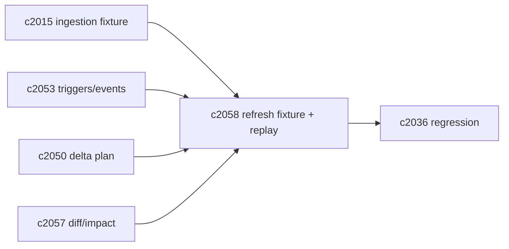
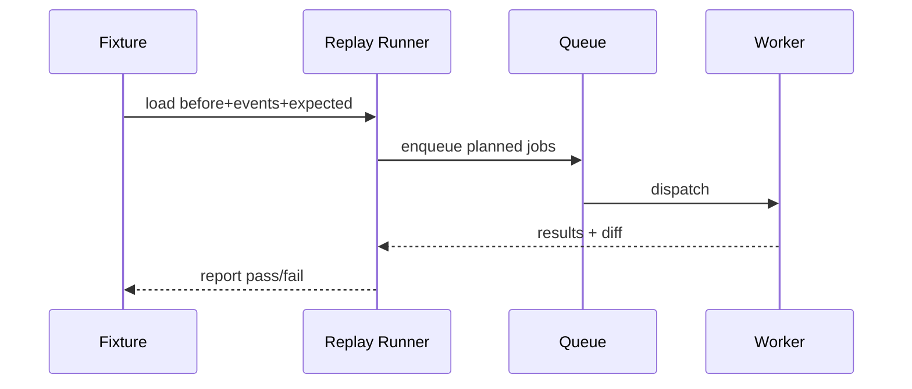

## Why

刷新/索引相关的 bug 很难靠单元测试覆盖，因为它往往依赖“真实的变化序列”：先抓取、再解析、再切块、再 re-embed、再迁移……任何一步变动都会影响最终可见性与 staleness。

我们已经有 ingestion 的 trace/fixture（`c2015`），也有检索/引用回归（`c2036`）。这条提案想把“刷新序列”也变成可回放的 fixture，这样才能在不靠线上复现的情况下修问题。

## What Changes

- 定义 `IndexRefreshFixture`：
  - before：sources/chunks/vector metadata 摘要（不要打包全量文本）
  - events：`c2053` 的 trigger 序列（带时间与 correlation）
  - expected：delta plan（`c2050`）+ job 结果摘要（`c2049`）+ diff report（`c2057`）
- 提供 replay runner：
  - 用 fixture 重放 planner/queue/refresh（可以只跑部分 stage）
  - 产出一致性 diff：计划是否一致、可见性是否一致、staleness reason 是否一致
- 与回归门禁对齐：
  - fix refresh bug 时，优先补一个 fixture，再修实现（这条是习惯，不是硬门禁）

## Capabilities

### New Capabilities

- `index-refresh-regression-fixtures-and-replay`: 定义刷新 fixture、回放 runner 与一致性 diff。

### Modified Capabilities

- `ingestion-trace-and-replay-fixtures`: 可复用脱敏/存储策略。（`c2015`）
- `refresh-trigger-contracts-and-event-hooks`: fixture 事件结构对齐。（`c2053`）
- `source-change-log-and-delta-indexing-planner`: 期望计划需要可序列化。（`c2050`）
- `index-refresh-diff-and-change-impact-reports`: diff 报告是 fixture 的 expected。（`c2057`）
- `retrieval-citation-regression-suite-and-quality-gates`: fixture 可作为回归输入。（`c2036`）

## Impact

- Backend/DevEx：需要 fixture 格式与 replay runner；并且把“脱敏边界”写清楚（默认不要存大文本）。
- Risk：fixture 如果没有版本治理，会很快坏掉；所以必须在 fixture 里写清楚版本摘要与兼容策略（宁可升级，不做兼容）。

## Dependency Sketch

