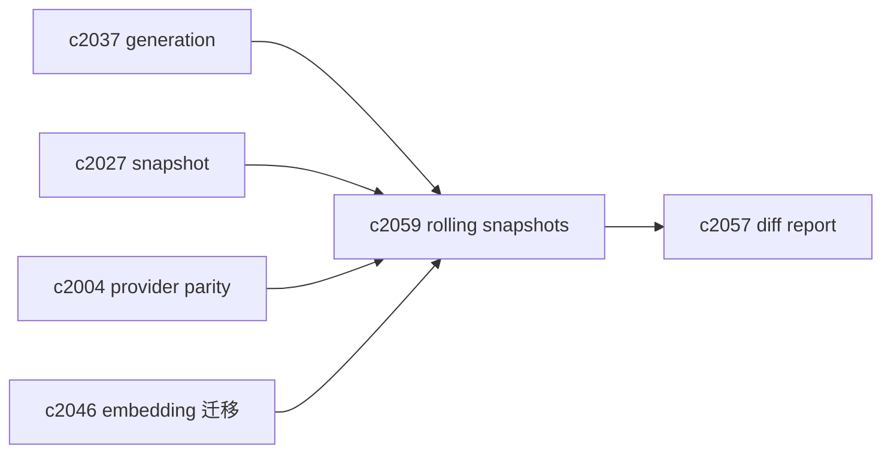

## Why

“昨天还能搜到，今天搜不到了”这种问题，如果只能用当前索引排查，基本就是徒劳。你需要的不是更多日志，而是能对比两件实物：**昨天那份索引快照**和**今天这份索引快照**。

`c2037` 已经引入 generation 的概念，`c2027` 也开始强调 snapshot_id。但如果我们不保留一定的历史，time-travel debug 就无从谈起；embedding 升级（`c2046`）想回滚也会很痛。

这条提案想把“保留少量历史索引快照”正式化：不是做备份系统，而是做一个可控的调试与回滚抓手。

## What Changes

- 定义 rolling index snapshots：
  - 对每个 notebook 保留最近 `N` 个 generation（或最近 `T` 天）
  - 每个 snapshot 记录：generation_id、embedding_model_id、build_time、覆盖范围摘要
- 提供 time-travel read：
  - 允许检索在 debug 模式 pin 到某个历史 generation（对齐 `c2027` 的回放）
  - 产出 generation diff（对齐 `c2057`），帮助解释“变化从哪来的”
- 明确清理策略：
  - 自动淘汰最老 generation
  - 高风险迁移（`c2046`）期间可临时延长保留窗口

## Capabilities

### New Capabilities

- `rolling-index-snapshots-and-time-travel-debug`: 定义滚动索引快照、time-travel 读取与清理策略。

### Modified Capabilities

- `vector-index-generation-ids-and-atomic-read-snapshots`: generation 需要可被历史保留。（`c2037`）
- `retrieval-snapshot-ids-and-deterministic-replay`: snapshot_id 需要能指向历史 generation。（`c2027`）
- `embedding-model-upgrades-and-safe-vector-migrations`: 迁移需要用快照做回滚边界。（`c2046`）
- `index-refresh-diff-and-change-impact-reports`: generation diff 复用报告格式。（`c2057`）
- `vector-store-contract-and-provider-parity`: provider 需要声明是否支持多 generation 保留。（`c2004`）

## Impact

- Backend：需要实现“多 generation 并存 + 清理”；不同 provider 实现方式不同，但契约需要一致。
- Frontend：诊断面可以提供“切到昨天的索引看一下”的入口（可藏在高级模式）。
- Risk：存储成本会上升；必须有硬上限与按 notebook 热度的策略。

## Dependency Sketch



```mermaid
flowchart TD
  GEN1[gen-1] --> KEEP[retained]
  GEN2[gen-2] --> KEEP
  GEN3[gen-3(active)] --> KEEP
  KEEP --> TTL[cleanup policy]
  TTL --> DROP[evict oldest]
```
