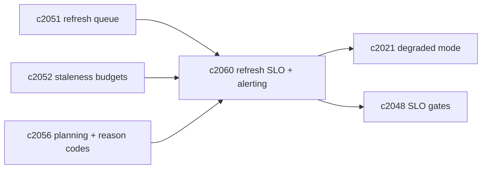
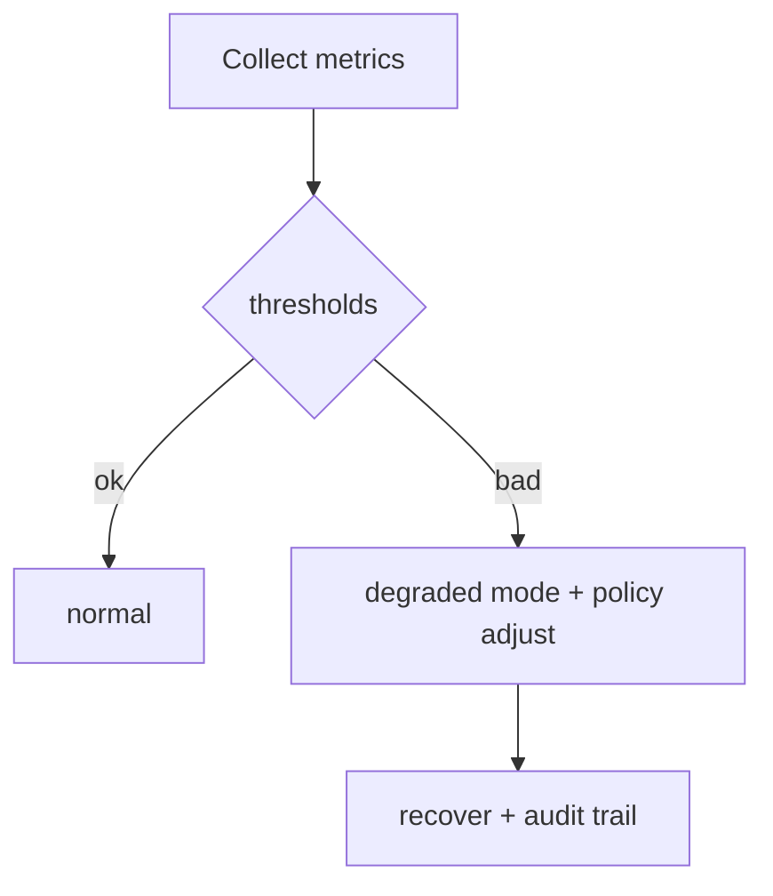

## Why

检索 SLO（`c2048`）盯的是“请求侧体感”。但索引刷新还有一组更基础的健康指标：**队列积压、time-to-visible、staleness 超预算比例**。

如果不把这些指标拉出来并设告警，团队往往会在“用户抱怨搜不到”之后才发现刷新早就堆死了。

这条提案的目标是：把 refresh 健康度变成可观察对象，并且能触发明确的应对动作（降级/暂停后台/提升优先级/清理积压）。

## What Changes

- 定义 refresh SLO metrics（按 notebook/profile/provider）：
  - `refresh_backlog_size`（按 domain/priority）
  - `refresh_time_to_visible_p95`（从 change log 到域就绪，按 domain）
  - `staleness_over_budget_ratio`（对齐 `c2052`）
  - `refresh_fail_rate` + top reason codes（对齐 `c2056`）
- 定义 backlog alerting policies：
  - 超阈值触发 degraded mode 提示（对齐 `c2021`）
  - 自动调整策略：降低 auto recheck、暂停 maintenance、提升 interactive lane（对齐 `c2051/c2043`）
- 让指标能进入门禁：
  - 在关键变更（迁移/调参）后，刷新 SLO 不能明显退化（对齐 `c2048`）

## Capabilities

### New Capabilities

- `index-refresh-slo-metrics-and-backlog-alerting`: 定义刷新 SLO、积压告警与自动应对策略。

### Modified Capabilities

- `retrieval-slo-metrics-and-drift-gates`: 门禁需要吸收 refresh SLO。（`c2048`）
- `refresh-queue-coalescing-backpressure-and-fairness`: backlog 计算来自队列。（`c2051`）
- `consistency-levels-staleness-budgets-and-read-policies`: over budget 比例需要预算定义。（`c2052`）
- `staleness-aware-query-planning-and-result-explanations`: reason codes 需要统一。（`c2056`）
- `profile-capability-matrix-and-degraded-mode-explainer`: degraded mode 文案需要依据 metrics。（`c2021`）

## Impact

- Backend/Obs：需要把 refresh 的关键路径埋点并聚合，输出 dashboard/告警；并且提供自动应对的开关与审计。
- Risk：告警如果太敏感会疲劳；第一版要从“明显坏了”的阈值开始。

## Dependency Sketch

