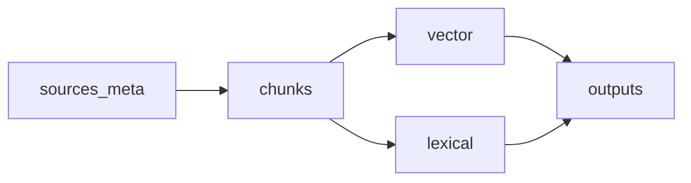
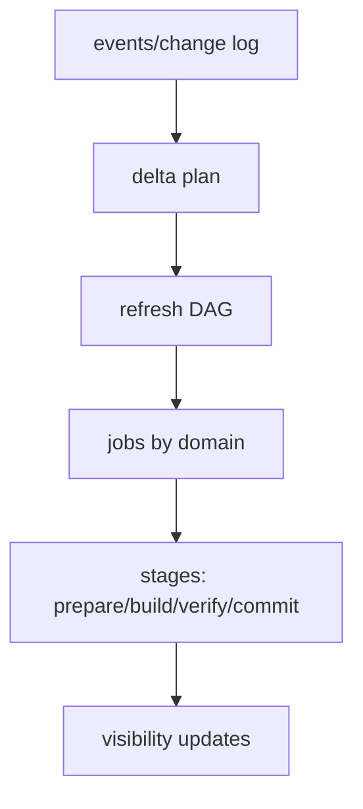

## Why

我们现在已经把刷新（job）、变化（change log）、队列（coalesce/backpressure）和一致性（consistency/budget/barrier）一条条提出来了，但还有一个容易被忽略的坑：**各索引域的“刷新到底做哪些步骤”仍然不统一**。

一旦不同模块用不同 stage 命名、不同依赖关系、不同成功判定，后果会很直接：

- `c2054` 的进度摘要没法做到“跨域可读”；
- `c2055` 的写屏障很难定义提交点；
- `c2056` 的 staleness-aware 规划会变成拍脑袋；
- 回归/fixture（`c2058`）也没法稳定描述“同一条刷新序列”。

所以这条提案不做更多功能，它做一件更基础的事：把刷新当成一张 DAG（有依赖、有 stage、有产物）写成契约。

## What Changes

- 定义 `IndexDomainRefreshDAG`：
  - 节点：`IndexDomain`（sources_meta/chunks/vector/lexical/outputs…）
  - 边：明确依赖（例如 vector 必须依赖 chunks；outputs 可能依赖 citations/outputs 本身）
  - 每个节点声明它的最小 stage 集合（stage 名、输入、输出、失败分类）
- 定义统一 stage 命名（最小集合）：
  - `prepare`（载入版本摘要/锁/plan digest）
  - `build`（核心构建：parse/chunk/embed/index…）
  - `verify`（一致性/采样校验）
  - `commit`（生成 commit_token / swap 可见性）
- 定义 stage outputs（用于诊断/回归/影响报告）：
  - counts：sources/chunks/vectors/docs
  - hashes：content_hash/chunk_hash/plan_digest
  - ids：generation_id/commit_token
- 明确跨域提交点规则：
  - 哪些域必须“全域一起提交”（例如 chunks+vector 同代际）
  - 哪些域允许独立提交（例如 sources_meta）

## Capabilities

### New Capabilities

- `index-domain-refresh-dag-and-stage-contract`: 定义索引域刷新 DAG、统一 stage 与提交点语义。

### Modified Capabilities

- `index-refresh-job-model-and-visibility-lifecycle`: job 需要承载 domain+stage 语义。（`c2049`）
- `source-change-log-and-delta-indexing-planner`: delta plan 需要生成 DAG 输入。（`c2050`）
- `refresh-progress-summaries-and-user-facing-diagnostics`: 进度摘要依赖统一 stage。（`c2054`）
- `indexing-idempotency-and-write-barrier-contract`: commit_token 依赖 stage/verify 输出。（`c2055`）

## Impact

- Backend：需要把刷新流程从“散落在各处的步骤”收口到可枚举 DAG；并让每个域的 worker 输出同一套 stage/outputs。
- Frontend：不必立即做新页面，但“刷新在做什么”终于能被一致地表达。
- Risk：如果 DAG 设计得太理想化，会卡住现实实现；所以第一版只要求最小 stage 和最小 outputs。

## Dependency Sketch

