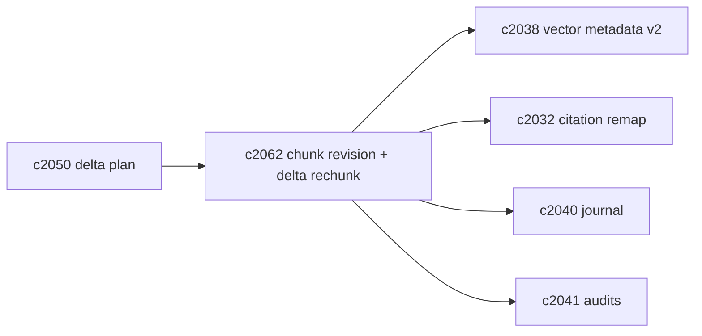
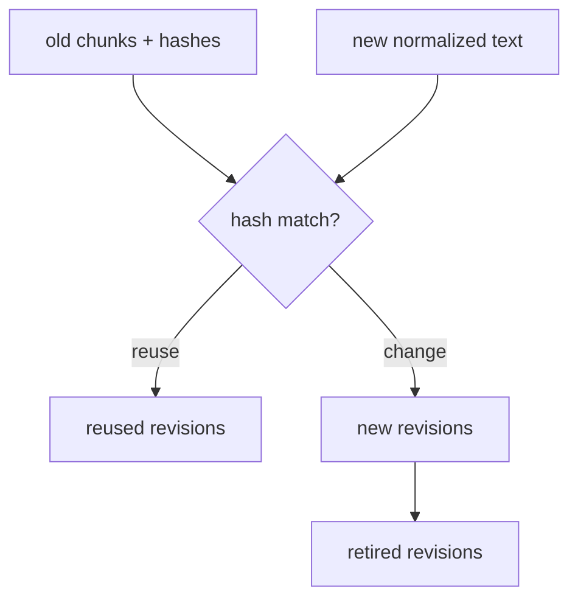

## Why

“切块变了”几乎是索引刷新里最昂贵、也最容易引发连锁反应的一类变化：

- 向量要重建（embedding 成本）；
- lexical 要重建（倒排/高亮映射成本）；
- 引用更容易飘（`chunk_id` 不再对应同一句话）。

我们已经有 `chunk_hash`/metadata v2 的方向（`c2038`），也有引用 remap（`c2032`）的方向，但如果每次内容小改都触发“全量重切块”，整个系统会一直处在“重建中”。

这条提案想补一个更工程化的中间层：**chunk revision + delta rechunking**。把“可复用的部分”稳稳复用掉，减少索引 churn。

## What Changes

- 定义 `ChunkRevision`：
  - `chunk_id`（逻辑身份）+ `revision_id`（版本）
  - `chunk_hash`（归一化后的文本指纹）
  - `replaces_revision_id`（可选，用于 lineage）
- 定义 delta rechunking：
  - 输入：旧版本的 chunk 列表（hash+边界） + 新版本的归一化文本
  - 输出：
    - `reused_revisions`（hash 命中直接复用）
    - `new_revisions`（新增或变更的部分）
    - `retired_revisions`（被替换/删除的部分）
  - 规则：只要 `chunk_hash` 相同就视为可复用（哪怕 chunk_index 变化）
- 与索引域刷新联动：
  - vector/lexical 刷新默认只处理 `new_revisions`，并保留 `reused_revisions` 的向量/倒排条目
  - 引用 remap 优先基于 revision lineage（对齐 `c2032`）

## Capabilities

### New Capabilities

- `chunk-revision-ids-and-delta-rechunking`: 定义 chunk revision、delta rechunking 与复用规则。

### Modified Capabilities

- `vector-entry-metadata-v2-and-drift-detection`: 向量条目需要绑定 chunk_revision/hash。（`c2038`）
- `citation-anchor-drift-detection-and-remap-jobs`: remap 优先消费 revision lineage。（`c2032`）
- `source-change-log-and-delta-indexing-planner`: planner 需要能选择 full vs delta。（`c2050`）
- `indexing-journal-and-resumable-backfills`: journal 需要记录 delta 结果摘要。（`c2040`）
- `vector-index-consistency-audits-and-repair-jobs`: 审计需要按 revision 对账。（`c2041`）

## Impact

- Backend：需要 chunk revision 表达与 delta rechunking 算法（先从“hash 复用”做起，不追求完美 diff）。
- Frontend：引用/诊断面可以更明确地说“这次只重建了 12% 的 chunks”，以及哪些引用可能受影响。
- Risk：delta 算法如果误判复用，会造成“内容变了但向量没变”；所以必须把 drift detection（`c2038/c2041`）作为护栏。

## Dependency Sketch

