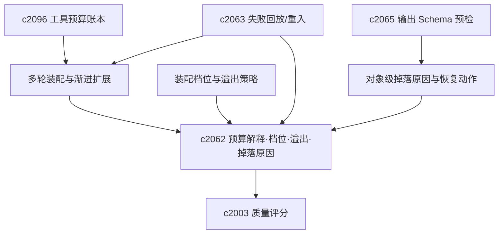

## Why

生成质量常与**上下文如何装入窗口**相关，而非仅模型本身；已有 RAG、压缩、检索与生成，但 token 预算与取舍仍不够可见，用户认真对比结果时迟早会追问。窗口不足时必然要丢内容，关键在**按何规则丢、用户能否理解本次为何如此**——缺少装配档位与溢出策略，表现波动会显得玄。更进一步，**并非一次塞满最优**：更合理的是轻量上下文先试跑，再按规则渐进扩展；若每轮扩展无清晰理由，staging 会变成新的黑箱。

而真正让人不安的不是"被裁掉了"，而是"不知道裁掉了什么、也不知道该怎么补救"。没有对象级掉落原因和恢复动作，token budget explainability 只能算看到了一半。

本提案把**上下文装配的全链可解释性**——从总量预算到档位策略、从多轮渐进到对象级掉落原因、再到可执行的恢复建议——统一为一条完整的 context assembly explainability 链路。

> 合并说明：本提案合并了原 `context-window-packing-profiles-and-overflow-strategies`、`multi-pass-context-staging-and-progressive-expansion`、`context-assembly-drop-reasons-and-recovery-actions` 的全部内容。

## What Changes

### 1. 可解释的上下文装配与预算拆分

- 定义 context packing 过程可解释摘要（来源片段、历史对话、结构化信号各占预算）
- 支持 token budget breakdown
- 为不同生成模式稳定 packing policy 边界
- 将裁剪、压缩与超限提升为正式诊断能力

### 2. 装配档位与溢出策略

- 定义 context window packing profile（如研究优先、引用优先、结构优先）
- 定义 overflow strategy（窗口不足时裁剪与压缩优先级）
- 装配档位与输出类型、任务形态、模型能力挂钩
- 用户可见当前策略，非完全黑箱

### 3. 多轮装配与渐进扩展

- 定义 multi-pass context staging（由轻到重多阶段）
- progressive expansion 在前一轮不足时按明确规则扩展
- staging 与掉落原因、预算账本、风险刹车协同
- 每轮扩展有清楚理由

### 4. 对象级掉落原因与恢复动作

- 定义 context drop reason，明确是因为长度、重复、低权重、格式不兼容还是时效性问题而被排除
- 增加 recovery action，给出"压缩后再试""改用摘要""提升优先级""拆成两次 run"这类补救建议
- 支持按来源、片段、摘录和 note block 展示上下文去留原因
- 让掉落信息能回流到阅读队列、摘录编织和 run 模板调参

## Capabilities

### New Capabilities

- `context-packing-and-token-budget-explainability`：上下文装配、预算拆分与取舍解释语义。
- `context-window-packing-profiles-and-overflow-strategies`：装配档位、溢出策略与可见性边界。
- `multi-pass-context-staging-and-progressive-expansion`：多轮上下文装配与渐进扩展。
- `context-assembly-drop-reasons-and-recovery-actions`：对象级掉落解释和补救动作。

### Modified Capabilities

- `generation-core`：暴露生成前上下文装配摘要。
- `source-aware-generation-modes`：各模式声明上下文优先级与装配偏好。
- `generation-observability-and-guardrails`：预算占用与裁剪原因信号。
- `retrieval-and-cache`：解释纳入或裁掉检索结果的原因。
- `model-capability-profiles-and-output-compatibility`：约束可用装配档位。
- `preflight-output-schema-compatibility-checks`：预检阶段提前暴露格式不兼容导致的掉落。
- `tool-budget-ledger-and-step-cost-attribution`：成本账本表达每轮装配代价。
- `research-run-failure-replay-and-step-reentry`：回放可重走某一轮上下文扩展。

## Impact

- **Backend**：上下文装配器、压缩、裁剪、轮次记录、日志与诊断接口、预算控制、掉落决策记录。
- **Frontend**：研究详情、输出解释面板、高级调试、run 解释、上下文预览、重试建议入口。
- **Dependencies**：紧贴 `c2063` 失败回放/时间线；为 `c2003` 质量评分提供更可比较的上下文解释维度。

## Dependency Sketch

