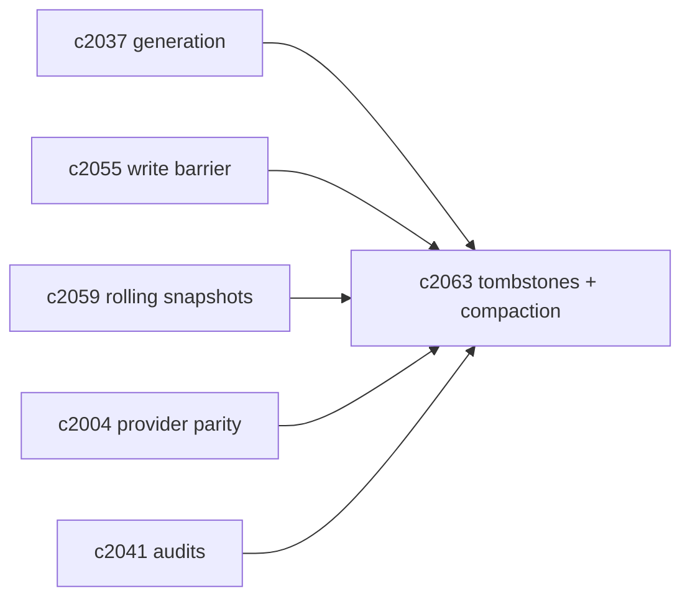
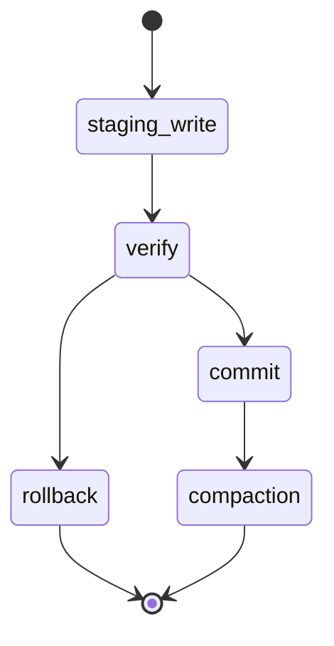

## Why

现有向量写入路径里有一个很典型的“不够工程”的点：为了重建某个 source，我们会先 remove，再 add。这个顺序在单机/低并发里还能忍，但放到“索引刷新 + 可见性契约”里就不行了：

- 在 remove 与 add 之间，读取可能看到“这份 source 没有向量”（短暂洞）；
- 多 generation 并存（`c2037/c2059`）时，硬删会破坏历史快照；
- 写入失败时，很难区分“该回滚”还是“该续跑”（只能靠猜）。

这条提案把向量写入升级成“可提交、可回滚、可压缩”的索引写路径：staging 写入、tombstone 删除、compaction 清理。

## What Changes

- 定义 vector write atomicity：
  - 单个 scope（source 或 notebook）的向量写入必须以“提交点”为单位生效（对齐 `c2055`）
  - 未提交的写入不可见，失败可丢弃/重试
- 定义 tombstones：
  - 删除/替换不直接物理删除，而是写 tombstone（带 generation_id/revision_id）
  - 查询默认过滤 tombstone；历史快照仍可读旧 generation
- 定义 compaction：
  - 在保留窗口外（对齐 `c2059`），清理旧 generation 与 tombstoned 条目
  - compaction 属于 maintenance lane（对齐 `c2043/c890`），可暂停可恢复
- provider 行为收口：
  - `c2004` 的 parity suite 必须覆盖 tombstone+compaction 的可见性语义（至少以模拟实现）

## Capabilities

### New Capabilities

- `vector-write-atomicity-tombstones-and-compaction`: 定义向量写入提交点、tombstone 与压缩清理语义。

### Modified Capabilities

- `vector-index-generation-ids-and-atomic-read-snapshots`: 写入围绕 generation/staging。（`c2037`）
- `indexing-idempotency-and-write-barrier-contract`: commit_token 与写入原子性对齐。（`c2055`）
- `rolling-index-snapshots-and-time-travel-debug`: compaction 受保留窗口约束。（`c2059`）
- `vector-store-contract-and-provider-parity`: provider 需要声明支持度。（`c2004`）
- `vector-index-consistency-audits-and-repair-jobs`: 审计需要识别 orphan/tombstone。（`c2041`）

## Impact

- Backend：向量层会从“CRUD”升级为“索引写路径”，但换来的是真正可解释、可回滚的一致性。
- Frontend：诊断面可以说清楚“这次重建还没提交，所以你还看的是旧索引”，不会再出现诡异洞。
- Risk：tombstone/compaction 会增加存储与复杂度；必须和 rolling snapshots 的保留策略绑定，避免无限增长。

## Dependency Sketch

