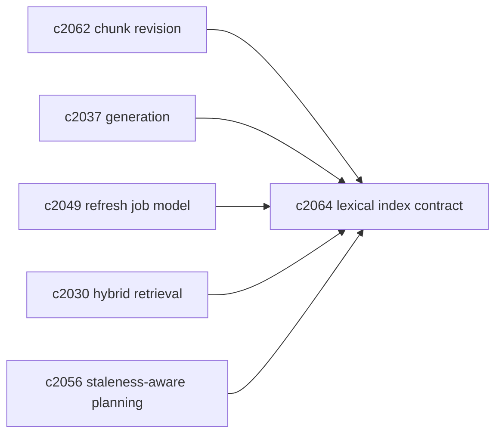
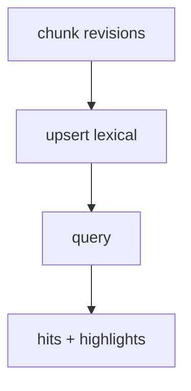

## Why

如果我们把 hybrid retrieval（`c2030`）真正做起来，lexical 就不再是“可有可无的备选”，而会变成一个需要被刷新、被诊断、被回放的索引域。

向量域已经在往 generation/metadata/审计走（`c2037/c2038/c2041`），但 lexical 域如果没有同等级的契约，系统会出现一种很割裂的体验：

- 你刚更新了内容，向量结果是新的，lexical 还是旧的；
- UI 高亮/片段预览对不上，用户以为系统“乱跳”；
- 回放时同一个 query 在 lexical 路径上不可复现。

所以这条提案把 lexical 索引当成正式域：定义它的刷新落点与增量策略。

## What Changes

- 定义 `LexicalIndex` 的最小契约：
  - 输入单位：`chunk_revision`（对齐 `c2062`），不是“整份 source”
  - 支持查询：term/phrase、字段限定（title/url/text，可选）
  - 支持返回：命中 chunk_revision + highlight spans（用于 UI 预览）
- 定义 lexical 增量刷新策略：
  - `added/updated` chunk_revision → upsert 到 lexical
  - `retired` chunk_revision → tombstone/删除（对齐 `c2063` 的删除语义）
  - 与 generation 对齐：lexical 也应受 `c2037` 的读快照约束（至少在同一“可见性提交点”上）
- 与 staleness-aware 规划对齐：
  - 如果 lexical stale 且请求为 strong consistency，planner 必须决定 wait/降级/绕开 lexical（对齐 `c2056`）

## Capabilities

### New Capabilities

- `lexical-index-contract-and-incremental-refresh`: 定义 lexical 索引契约、增量刷新与可见性边界。

### Modified Capabilities

- `hybrid-retrieval-lexical-vector-fusion-and-fallbacks`: lexical 结果需要可解释且可回放。（`c2030`）
- `index-refresh-job-model-and-visibility-lifecycle`: lexical 作为正式 domain。（`c2049`）
- `chunk-revision-ids-and-delta-rechunking`: lexical 以 revision 为输入。（`c2062`）
- `vector-index-generation-ids-and-atomic-read-snapshots`: lexical 可见性应对齐 generation。（`c2037`）
- `staleness-aware-query-planning-and-result-explanations`: planner 需要理解 lexical staleness。（`c2056`）

## Impact

- Backend：需要一个 lexical 索引实现与 adapter，但更重要的是“语义一致”：增量、可见性、回放都要能说清楚。
- Frontend：可以先只在调试面展示 lexical 命中与高亮，不急着做复杂开关。
- Risk：lexical 和 vector 的双域一致性会带来更多组合爆炸；所以要依赖 `c2061` 的 DAG 与 `c2055` 的提交点。

## Dependency Sketch

