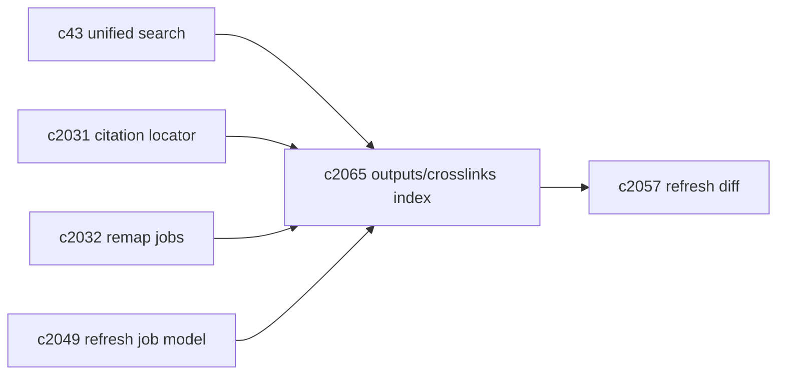
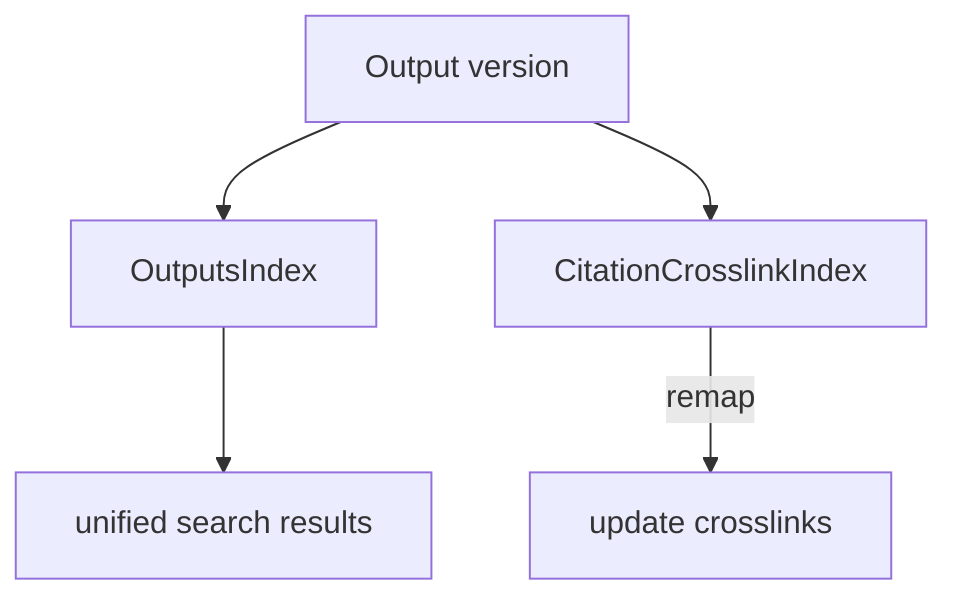

## Why

统一搜索（`c43`）最终一定会走到“不仅搜来源，也能搜产物/段落/结论”。但产物（outputs）有两个特点：

- 它是“会变的”：refine、重生成、版本对比都在改变内容；
- 它强依赖引用：一旦引用锚点 remap（`c2032`），产物里那些 crosslink 也得跟着更新。

如果 outputs 索引不被当成正式索引域，它会长期处于“偶尔能用、偶尔乱跳”的状态——尤其在 refresh/backfill/迁移频繁的阶段。

这条提案把 outputs/citation crosslinks 作为索引域落地：定义它的刷新触发点、可见性与增量更新策略。

## What Changes

- 定义 `OutputsIndex`（最小语义）：
  - 可检索对象：output（title/sections）、段落块、主张摘要（如有）
  - 结果跳转：能跳到 output 版本 + block/span（与 `c230/c2031` 对齐）
- 定义 `CitationCrosslinkIndex`：
  - 从 output_span → citation locator（`c2031`）
  - 当 citation remap 发生（`c2032`），crosslink index 需要增量更新/标记低置信度
- 定义刷新触发与提交点：
  - output 新建/更新 → outputs domain refresh
  - citation locator 变更 → crosslinks refresh
  - 可见性受 `c2055` 写屏障保护（避免“新内容旧链接”）
- 与 diff/影响报告对齐：
  - refresh diff 需要覆盖 outputs/crosslinks 的变化摘要（对齐 `c2057`）

## Capabilities

### New Capabilities

- `output-search-index-and-citation-crosslinks-refresh`: 定义 outputs/crosslinks 索引域、增量刷新与可见性语义。

### Modified Capabilities

- `unified-search-query-and-rerank`: 搜索结果模型要能容纳 outputs 索引。（`c43`）
- `citation-locator-v2-and-anchor-confidence`: crosslinks 以 locator 为 SSOT。（`c2031`）
- `citation-anchor-drift-detection-and-remap-jobs`: remap 触发 crosslinks 更新。（`c2032`）
- `index-refresh-job-model-and-visibility-lifecycle`: outputs/crosslinks 作为正式 domain。（`c2049`）
- `index-refresh-diff-and-change-impact-reports`: diff 要覆盖 outputs。（`c2057`）

## Impact

- Backend：需要 outputs/crosslinks 的索引结构（哪怕一开始很轻），并把它们纳入 refresh DAG 与提交点。
- Frontend：统一搜索与阅读器可以更稳定地做“从结论跳证据/从证据跳结论”的闭环。
- Risk：outputs 索引如果过重会拖慢生成；所以必须支持异步刷新与增量更新。

## Dependency Sketch

