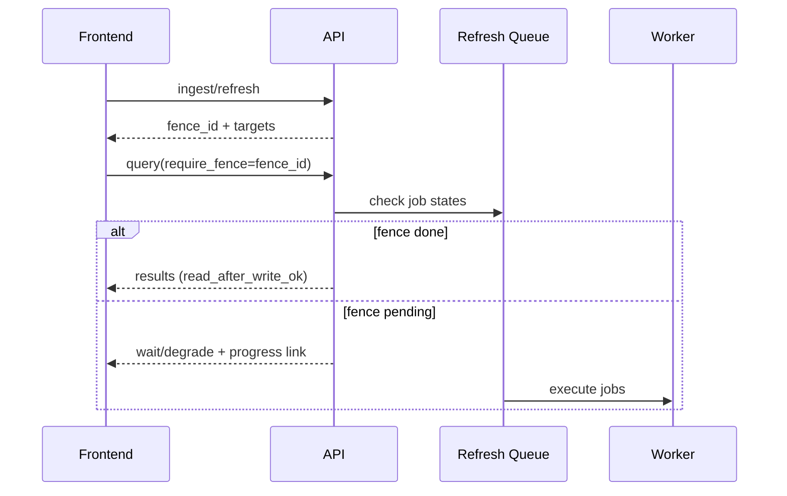
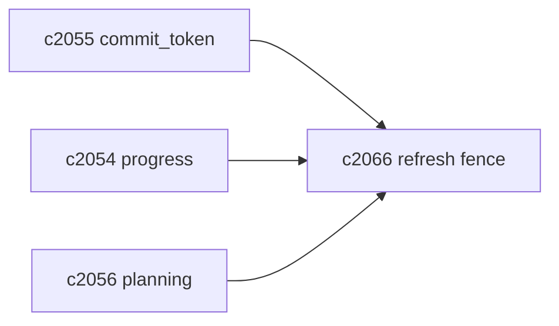

## Why

一致性级别（`c2052`）解决了“读想要多新”的语义，但用户在真实操作里更常说的是另一句话：**我刚做的事，为什么还搜不到/还没生效？**

这类问题很难靠“让用户选 strong”解决，因为它是端到端的：

- 用户触发 ingestion 或手动刷新；
- 系统生成 delta plan、入队、执行、提交；
- 用户下一次读取（搜索/问答/引用查看）希望对齐这次写入的结果。

我想引入一个更贴近交互的概念：refresh fence。它像一个“这次写入对应的承诺点”，读请求可以选择是否等待它达成。

## What Changes

- 定义 `RefreshFence`：
  - `fence_id`
  - `targets`：一组 `(domain, scope, commit_token)`（对齐 `c2055`）
  - `created_at`、`correlation_id`（对齐 `c2002`）
- 写请求返回 fence：
  - ingestion/recheck/re-embed/迁移等动作返回 fence_id（可选）
  - 前端可把 fence_id 挂到后续“立即问答/立即搜索”的请求上
- 读请求支持 `require_fence`：
  - fence 未达成 → planner 决定 wait/降级/返回进度入口（对齐 `c2056/c2054`）
  - fence 达成 → 返回结果并标记 `read_after_write_ok=true`
- fence 状态查询：
  - “这次写入还差哪些域没提交” + 预计完成时间（结合 `c2054/c2060`）

## Capabilities

### New Capabilities

- `refresh-fences-and-read-after-write-guarantees`: 定义 refresh fence、read-after-write 请求语义与状态查询。

### Modified Capabilities

- `indexing-idempotency-and-write-barrier-contract`: fence target 以 commit_token 为基座。（`c2055`）
- `consistency-levels-staleness-budgets-and-read-policies`: fence 与 strong consistency 协同。（`c2052`）
- `staleness-aware-query-planning-and-result-explanations`: fence 未达成的解释与动作。（`c2056`）
- `refresh-progress-summaries-and-user-facing-diagnostics`: fence 需要进度摘要。（`c2054`）
- `request-context-and-correlation-ids`: fence 与请求串联。（`c2002`）

## Impact

- Backend：需要 fence 数据结构与状态求值，但它会极大改善“刚写完却读不到”的解释能力。
- Frontend：不要求强制使用 fence，但对于“写后立刻读”的主路径非常有价值。
- Risk：fence 如果被滥用会导致大量等待；所以必须和 budget/backpressure 配合（`c2051/c2052`）。

## Dependency Sketch

