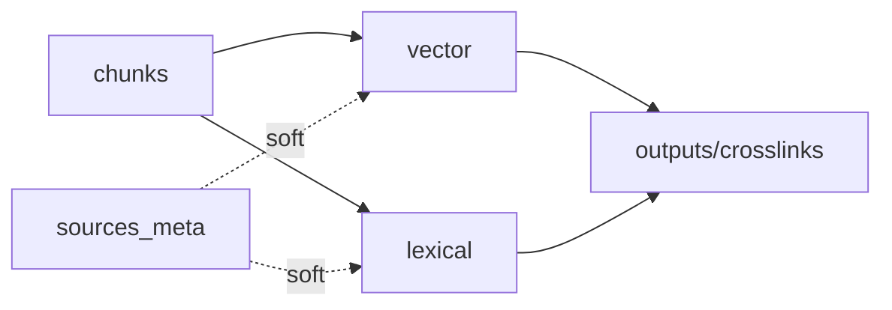
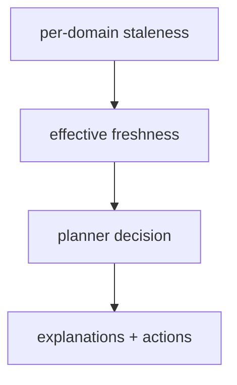

## Why

staleness 不是孤立状态。更真实的情况是“某个域落后导致另一个域的结果也不可信”：

- chunks stale → vector 必然 stale（因为向量对应旧 chunk）；
- citation crosslinks stale → outputs 搜索跳转会乱；
- sources_meta stale → 过滤条件可能错，但向量本身不一定错。

如果我们不把这种传播关系写出来，`c2056` 的 planner 很难做稳定决策，`c2052` 的 budget 也很难解释“为什么我强一致要等这么久”。

这条提案把 staleness 的传播做成一张图，并给出“有效新鲜度（effective freshness）”的计算规则。

## What Changes

- 定义 `StalenessPropagationGraph`（按 notebook/profile）：
  - 节点：IndexDomain
  - 边：依赖传播（hard/soft）
    - hard：chunks → vector（必然传播）
    - soft：sources_meta → query_filters（可能影响排序/过滤）
- 定义 `EffectiveFreshness`：
  - 对每个 domain 计算 `staleness_age` 与 `over_budget`（对齐 `c2052`）
  - 对请求计算 `effective_staleness`：取 hard 依赖的最大 staleness，再叠加 soft 风险提示
- 输出标准化解释字段：
  - `staleness_driver_domain`：导致本次结果“有效变旧”的主因域
  - `recommended_action`：refresh_now / wait / pin_snapshot
- planner 消费这套计算（对齐 `c2056`），避免每个入口重复算一遍。

## Capabilities

### New Capabilities

- `staleness-propagation-graph-and-effective-freshness`: 定义传播图、有效新鲜度计算与解释字段。

### Modified Capabilities

- `search-index-incremental-refresh-and-staleness-diagnostics`: staleness diagnostics 需要产出 per-domain age。（`c425`）
- `index-refresh-job-model-and-visibility-lifecycle`: 可见性需要按 domain 表达。（`c2049`）
- `consistency-levels-staleness-budgets-and-read-policies`: effective freshness 依赖 budget。（`c2052`）
- `staleness-aware-query-planning-and-result-explanations`: planner 使用 effective freshness。（`c2056`）
- `index-refresh-diff-and-change-impact-reports`: diff 可引用 driver domain。（`c2057`）

## Impact

- Backend：需要一份明确的传播规则与计算函数，减少“staleness 解释像玄学”。
- Frontend：诊断面可以更像“这次结果旧在向量域”，而不是笼统“可能旧”。
- Risk：传播规则若过度复杂会难以维护；第一版只覆盖 hard 依赖 + 少量 soft 提示即可。

## Dependency Sketch

