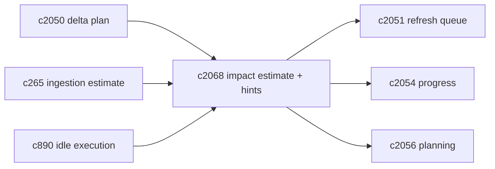
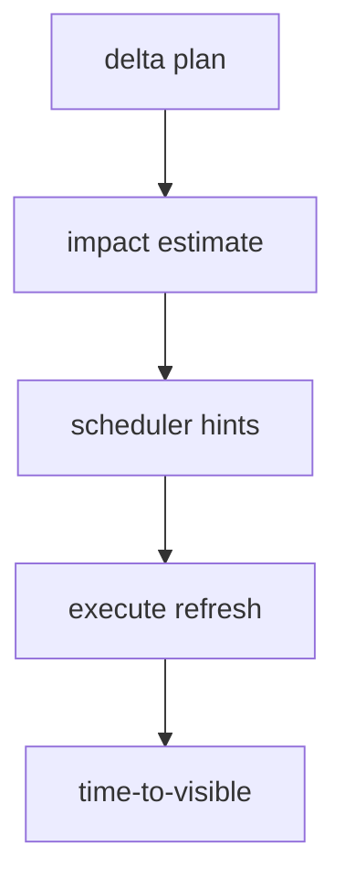

## Why

刷新队列之所以容易失控，很大一部分原因是：系统自己也不知道“这次刷新有多重、会影响哪些域、预计多久可见”。于是调度只能靠粗略优先级，前端也只能给出模糊等待。

我们在 ingestion 上已经有“工作量预估”的方向（`c265`），也有并发预算/背压可见性（`c345`）。这条提案把同类能力补到“索引刷新”上，用于三件事：

- 队列排序：重任务别挤爆交互路径（对齐 `c2051/c2043`）
- staleness-aware 决策：强一致到底值不值得等（对齐 `c2056`）
- 进度摘要：ETA 至少有个可信的下界（对齐 `c2054`）

## What Changes

- 定义 `RefreshImpactEstimate`（由 delta plan 产生）：
  - 影响域：chunks/vector/lexical/outputs…
  - 影响范围：sources_count、expected_chunks_changed
  - 预计成本：embedding_tokens、vector_upserts、lexical_docs
  - 预计 time-to-visible（按 domain）
  - 风险提示：可能触发 staging swap / compaction（对齐 `c2037/c2063`）
- 定义 scheduler hints：
  - 建议 lane：interactive/background/maintenance（对齐 `c2043`）
  - 是否适合 idle window（对齐 `c890`）
  - 是否允许 partial visible（对齐 `c2055`）
- 估算结果写入 job 进度与诊断面（`c2054`），并被 query planner 消费（`c2056`）。

## Capabilities

### New Capabilities

- `refresh-impact-estimation-and-scheduler-hints`: 定义刷新影响预估、调度提示与 ETA 语义。

### Modified Capabilities

- `source-change-log-and-delta-indexing-planner`: planner 需要产出 impact estimate。（`c2050`）
- `refresh-queue-coalescing-backpressure-and-fairness`: queue 调度需要消费 hints。（`c2051`）
- `refresh-progress-summaries-and-user-facing-diagnostics`: 进度摘要需要 ETA/成本。（`c2054`）
- `staleness-aware-query-planning-and-result-explanations`: planner 需要消费 time-to-visible。（`c2056`）
- `ingestion-work-estimates-and-budget-preview`: 估算方法可复用/对齐。（`c265`）
- `background-refresh-windows-and-idle-execution`: hints 可建议进入 idle window。（`c890`）

## Impact

- Backend：需要一套可解释的估算器（宁可粗糙但稳定），并把估算作为调度/解释的共同输入。
- Frontend：能把“预计还有 20 秒可见”说得更靠谱，也能在 backlog 高时给出合理引导。
- Risk：ETA 如果经常错，会降低信任；所以第一版只输出区间或下界更稳。

## Dependency Sketch

