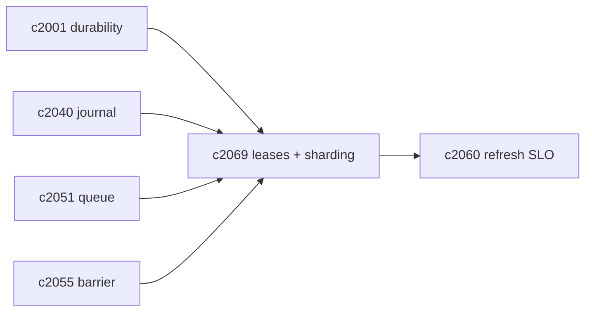
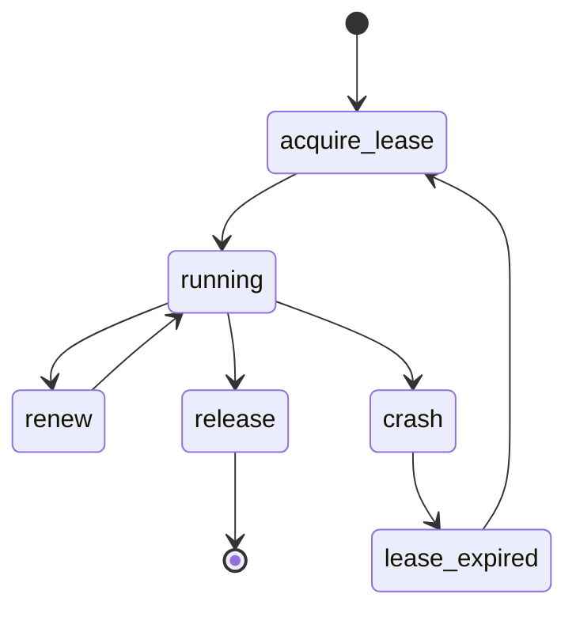

## Why

当 refresh job 变多、变细之后，“谁在跑它、同一时刻跑几个、会不会撞车”会成为一致性风险的主要来源。尤其在这些情况下：

- 多个 worker 同时拿到同一个 notebook 的 refresh job；
- 一个 job 跑一半 worker 崩了，另一个 worker 接手但不知道该从哪继续；
- 同 scope 的任务被合并/取消/重排，旧 worker 还在写。

我们已经有长任务可恢复（`c2001`）、队列合并（`c2051`）和写屏障（`c2055`）的方向，但缺一条明确的“锁/租约”契约，来保证刷新执行的并发安全。

## What Changes

- 定义 refresh execution lease：
  - `lease_key`：按 `(notebook_id, domain, scope)`（与队列 key 对齐）
  - `owner_id`、`ttl_s`、`renew`、`steal` 规则
  - lease 持有者才允许推进 journal stage/写入 staging generation
- 定义 worker sharding：
  - job 分发按 notebook_id hash（尽量保证同 notebook 在同 worker）
  - 允许跨 worker 接手，但必须先拿到 lease，并从 journal 续跑（对齐 `c2040`）
- 定义崩溃恢复边界：
  - lease 过期后允许接手
  - 接手必须先跑“安全检查”（例如 staging generation 是否有未提交写入）
- 与 degraded/backpressure 协同：
  - backlog 高时可以暂停 maintenance jobs，但 lease 仍需正确释放（对齐 `c2051/c2060`）

## Capabilities

### New Capabilities

- `refresh-worker-sharding-locking-and-leases`: 定义刷新 worker 分片、锁/租约与接手恢复语义。

### Modified Capabilities

- `task-runtime-durability-and-restart-reconciliation`: 恢复/对账与 lease/journal 对齐。（`c2001`）
- `indexing-journal-and-resumable-backfills`: 续跑必须以 journal 为 SSOT。（`c2040`）
- `refresh-queue-coalescing-backpressure-and-fairness`: dispatch 需要尊重 lease。（`c2051`）
- `indexing-idempotency-and-write-barrier-contract`: lease 保护提交点。（`c2055`）
- `index-refresh-slo-metrics-and-backlog-alerting`: backlog policy 需要考虑 lease。（`c2060`）

## Impact

- Backend：需要一套轻量 lease 存储（cache/DB 均可），以及接手逻辑；这会显著降低“并发撞车导致索引脏”的风险。
- Frontend：不直接影响 UI，但会减少刷新“卡死/反复失败”的体验问题。
- Risk：lease 实现如果不可靠会引入死锁；必须规定 TTL、超时与强制释放策略。

## Dependency Sketch

