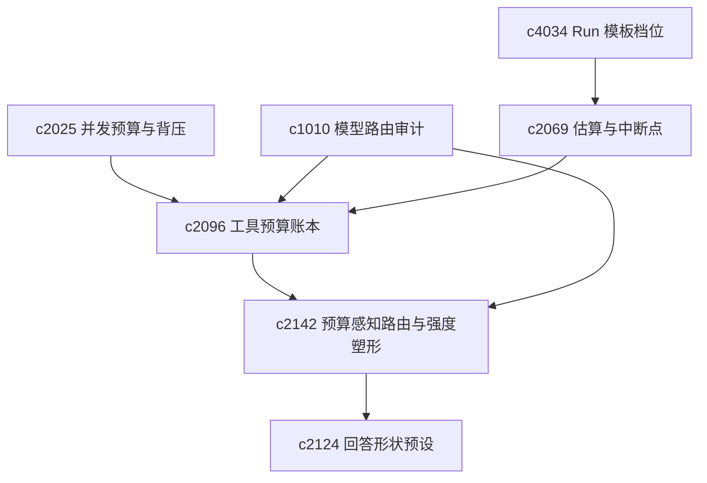

## Why

长 run 启动前，用户最需要两件事：**大概要多久、过程中能否打断**；没有预期，任务要么显得冒险，要么显得不受控。与此同时，用户能接受耗时与耗费，但前提是知道成本**花在了哪一步、哪个工具、哪类组合**——仅靠 run 级总数，难以做优化与复盘。更进一步，预算若只“看得见”却不进入路由，产品会默认走最贵、最重的路线；个人研究需要**在预算上限与目标类型下自动塑形执行强度**，同时保留用户一键覆盖，不把预算变成硬锁。

此外，用户一旦开始反复跑同类任务，就会想把一套默认参数和恢复偏好固定下来。没有 run 模板档位，每次都从头配一次，长任务的使用门槛一直偏高。模板档位自然是启动准备的一部分——模板决定"跑什么配置"，预估决定"大概多贵多久"，effort shaping 决定"用什么强度"。

**主题：Run cost governance: templates, estimates, budgets & effort routing**

> 合并说明：本提案合并了原 `tool-budget-ledger-and-step-cost-attribution`、`budget-aware-run-routing-and-effort-shaping`、`run-template-profiles-and-resume-defaults` 的全部内容。

## What Changes

1. **Run 模板档位与恢复默认（run template profiles & resume defaults）**：定义 run template profile，把常用执行配置收成可复用模板——目标默认值（mission brief 模板）、步骤粒度（细粒度确认 vs 批量执行）、来源策略（默认范围/质量下限/排除规则）、接管偏好（自动 vs 陪跑）；支持 resume default 控制恢复行为（从检查点恢复 / 从指定步骤重跑 / 只恢复结论）；区分一次性模板和长期模板（版本管理、stale 提示）；支持从已有 run 反向提炼模板（extract template）；run 启动器展示模板选择 → 参数微调 → 预估 → 确认执行。
2. **耗时与中断语义**：定义 run cost/time estimate，在启动前给出粗略耗时与复杂度预期；增加 interrupt point，标明哪些阶段适合暂停、确认或用户接管；区分乐观与保守预估，避免把估算包装成承诺；预估与中断点进入 run 详情，而非启动后即消失。
3. **工具账本与步骤归因**：定义 tool budget ledger，将 token、耗时、外部调用与失败重试等成本按步骤归因；支持将账本回给模板选择、路由解释与 postmortem；区分必要成本与回退造成的额外成本。
4. **预算感知路由与强度塑形**：定义 budget-aware routing，按当前预算上限与目标类型自动塑形执行强度；增加 effort shaping（轻探、标准、重证、高压精修等），影响上下文装配、模型选择与输出落点；用户可覆盖默认路由。

## Capabilities

### New Capabilities

- `run-cost-time-estimates-and-interrupt-points`：run 耗时预估、中断点与接管窗口语义。
- `tool-budget-ledger-and-step-cost-attribution`：工具账本、步骤归因与成本解释。
- `budget-aware-run-routing-and-effort-shaping`：预算感知路由与执行强度塑形。
- `run-template-profiles-and-resume-defaults`：run 模板档位、恢复默认项和模板生命周期。

### Modified Capabilities

- `agentic-research-runs`：run 启动和恢复消费模板档位、预估与中断点。
- `research-plan-and-execution-checklists`：计划需要能成为模板输入。
- `background-jobs-and-task-runtime`：阶段级中断点暴露；步骤级事件可供账本聚合。
- `concurrency-budgets-and-backpressure-visibility`：并发预算落到步骤账本；预估可消费队列与预算信息。
- `model-route-audit-and-decision-explanations`：路由解释可展示成本后果；估算侧实现上引用历史账本数据校准预估（与账本能力衔接）。
- `toolchain-capability-negotiation-and-fallback-order`：协商层吸收预算档位。
- `answer-shape-presets-and-output-landing-zones`：结果落点受 effort shaping 影响。

## Impact

- **Backend**：预估逻辑、阶段元数据、详情接口；run telemetry、步骤级指标与预算存储；执行路由、预算档位与强度策略。
- **Frontend**：启动提示、详情页与接管入口；成本提示、优化建议与 run 配置中的预算/强度默认值。
- **Dependencies**：与 `c4032` 类比但面向长任务执行；承接 `c2025`、`c1010`、`c2069` 估算线，并由账本细化可解释性，再由路由把预算接入“怎么跑”；与 `c2124` 等输出落点能力衔接。

## Dependency Sketch

