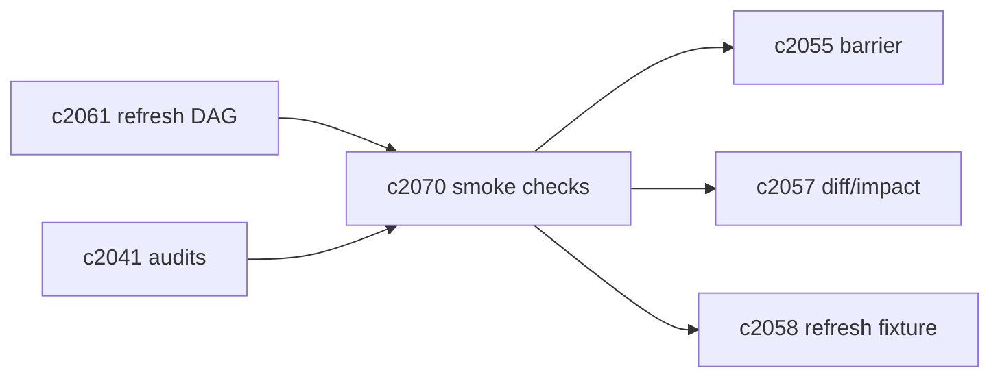
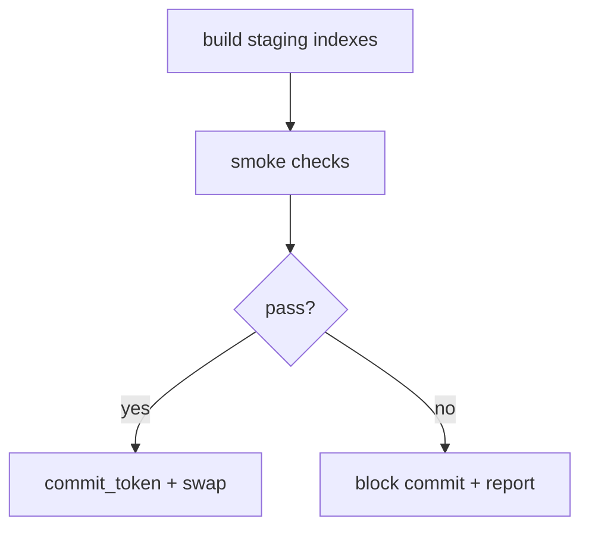

## Why

刷新完成（job ready）并不等于“可以放心读”。真正的灾难往往发生在提交之后才暴露：某个域漏刷了、某些条目写丢了、或跨域引用对不上。

我们已经有向量一致性审计（`c2041`）和 refresh diff/影响报告（`c2057`），但还缺一个更贴近写屏障的概念：**跨域 smoke checks**。它们不是全面体检，而是“提交前最后一道门”——跑得快、覆盖关键不变量、失败时直接阻断提交或明确降级。

## What Changes

- 定义 cross-domain smoke checks（按 refresh DAG 自动选择检查项）：
  - chunks → vector：`vector_entries_count >= new_chunk_revisions`（抽样对账）
  - chunks → lexical：lexical 覆盖率抽样（命中/高亮可解析）
  - outputs/crosslinks：引用 locator 可解析（对齐 `c2031`），低置信度比例不过线
  - visibility：commit_token 与 generation 对齐（对齐 `c2055/c2037`）
- smoke checks 与写屏障绑定：
  - checks 通过才允许生成/激活 commit_token（强路径）
  - 若允许“带警告提交”，必须返回 reason_code 并进入修复队列（对齐 `c2041`）
- 失败输出可复现材料：
  - 生成最小 refresh fixture 或 proof pack（对齐 `c2058/c2035`）

## Capabilities

### New Capabilities

- `cross-domain-refresh-validation-smoke-checks`: 定义跨域 smoke checks、提交门禁与失败输出。

### Modified Capabilities

- `index-domain-refresh-dag-and-stage-contract`: checks 随 DAG 选择。（`c2061`）
- `indexing-idempotency-and-write-barrier-contract`: checks 是提交点的一部分。（`c2055`）
- `vector-index-consistency-audits-and-repair-jobs`: 可复用审计分类与修复入口。（`c2041`）
- `index-refresh-diff-and-change-impact-reports`: checks 结果进入 diff 报告。（`c2057`）
- `index-refresh-regression-fixtures-and-replay`: 失败可产出 fixture。（`c2058`）

## Impact

- Backend：需要一套可配置的 smoke checks runner（快速、抽样、可并行），并把它接到 commit 逻辑上。
- Frontend：诊断面能明确显示“为什么这次刷新没提交：smoke check 失败在 vector 覆盖率”。
- Risk：如果 smoke checks 做得太重，会拖慢 time-to-visible；所以必须以抽样与关键不变量为主。

## Dependency Sketch

