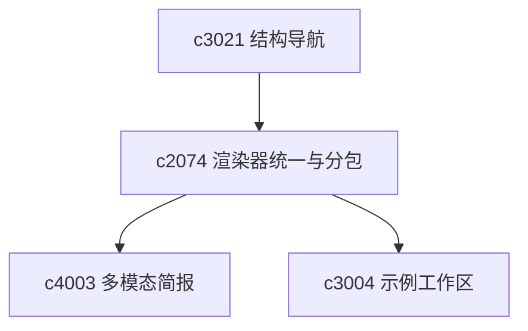

## Why

输出类型越来越多以后，前端最容易变乱的地方就是 renderer。现在已经有多种 output viewer、官方插件和 bundle 入口，但它们之间的装配方式还不够统一；同一种输出在不同页面、不同导出路径里也可能长得不一样。

模板升级时如果缺少版本与迁移边界，最后不是“不敢改”，就是“改了全线翻车”。需要把输出渲染做成一条可复用的管线：类型明确、模板可迁移、渲染可缓存、错误可解释。

## What Changes

- 收口输出类型与渲染器契约：
  - output type registry：每个输出类型必须声明 schema、renderer、可导出形态
  - renderer 输出必须能携带结构化错误（供 `c2167` 展示恢复动作）
- 收口 output renderer 的宿主契约：
  - 让官方输出和插件输出共享同一套最小装配面（加载态/错误兜底/capability 检测）
  - 统一 renderer 的 fallback 规则，不再每种输出自己兜
- 引入模板版本与迁移：
  - template 具备 `schema_version`，升级时提供迁移策略（不再靠“手改 JSON”）
  - 内置模板与用户模板的行为差异写清楚（覆盖/继承规则）
- 明确 renderer bundle splitting 策略：
  - 避免低频输出把高频主路径一起拖重
  - 与插件装配对齐：渲染器作为插件时，必须可追踪 bundle 信息（为性能门禁服务）
- 支持跨类型转换的稳定入口（引用 `cross-type-result-transformations`）：例如从 briefing 生成 slide outline。

## Capabilities

### New Capabilities
- `output-renderer-unification-and-template-versioning`: 输出类型 registry、renderer 宿主契约、模板版本迁移与分包边界。

### Modified Capabilities
- `output-rendering-and-typing`: 需要统一 renderer 输入载荷与宿主行为。
- `studio-output-types`: 各输出类型需要遵守统一渲染契约。
- `cross-type-result-transformations`: 跨类型转换的输入输出契约与错误表达。
- `fullstack-plugin-bundles`: 需要补输出渲染相关 bundle 拆分与加载边界。
- `official-plugins`: 官方插件目录需要表达渲染能力和分包信息。

## Impact

- Frontend：会影响 output viewer、插件注册、按需加载和错误兜底。
- Backend/API：主要影响输出载荷的一致性要求。
- Dependencies：建议先把 `c2008` 的 run 与 `c2006` 的事件契约收口，输出渲染才能自然接入统一生命周期；同时这条线承接 `c3021` 的结构导航，也会让 `c4003`、`c3004` 这类后续扩展更轻一点。

