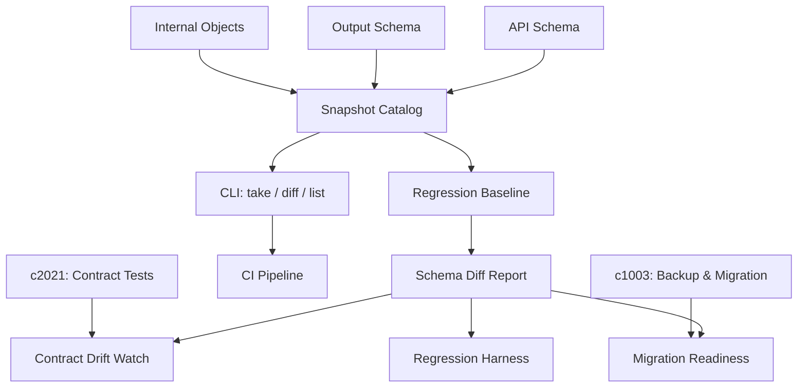

## Why

接口、输出 schema 和内部对象结构一旦开始演化，没有一组稳定快照，大家很快就会只知道“哪里又变了”，却说不清“到底是从哪一版开始变的”。快照目录是回归基线的骨架。

## What Changes

- 定义 schema snapshot catalog，按类型分区保存关键接口和输出结构的快照基线：
  - **API 快照**：OpenAPI/路由级 schema，每次发布自动抓取，标注版本号和 breaking change 标记
  - **Output 快照**：生成结果的结构模板（字段集合、嵌套层级、枚举取值范围），用于产品回归
  - **Internal 快照**：ORM model / DTO / event payload 的结构签名，用于内部迁移预检
- 每类快照支持 tag + timestamp + parent 链，形成可追溯版本线：知道"从哪一版变的"而不只是"又变了"
- 提供 regression baseline 能力：指定某一版快照为基线，后续 diff 自动对比并标注新增/删除/类型变更/可空性变化
- 快照差异输出为结构化 report，可被以下下游消费：
  - 契约漂移检查（`openapi-client-contract-drift-watch`）
  - 迁移就绪报告（`c1003` 的 readiness report）
  - 回归 harness（`c1017` 的 scenario fixtures）
- 支持 CLI 命令：`snapshot take`、`snapshot diff`、`snapshot list`，集成到 CI 流水线

## Capabilities

### New Capabilities
- `schema-snapshot-catalog-and-regression-baselines`: 定义 schema 快照目录、回归基线和差异边界。

### Modified Capabilities
- `openapi-client-contract-drift-watch`: 需要消费快照基线。
- `quality-and-regression`: 需要将快照比较纳入回归。
- `output-rendering-and-typing`: 输出结构快照需要有正式入口。

## Impact

- Backend：会影响快照生成、差异计算和基线管理。
- Frontend：主要影响诊断与维护视图。
- Dependencies：这条线和 `c2021`、`c1003` 是一组，补的是“变了以后怎么有据可依”。

## Dependency Sketch

