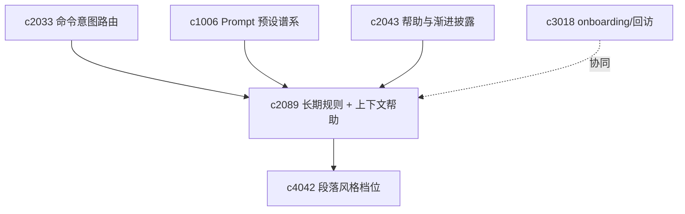
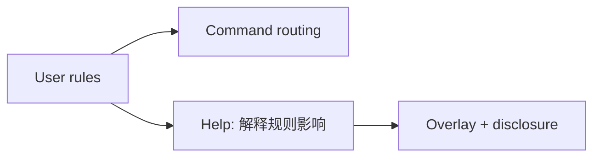

## Why

个人产品用久了，真正值钱的是「不用说第二遍」的偏好：先看证据还是结论、措辞克制程度、默认保守与否。这些偏好若散在 prompt、preset 与临时操作里，不够稳。**Durable user rule** 应成为长期的 **steering contract**，并区分风格、操作与安全偏好，避免混成黑盒。

工作台越强，越容易让新用户不知从何下手、老用户找不到高级入口。帮助若只有文档链接往往来不及；若满屏说明又碍事。需要**上下文帮助**与**渐进披露**：在关键动作上给刚好够用的说明，高级内容按需展开，并区分首次、久未使用与高级提醒，让帮助挂在对象与动作上而非漂在界面外。

> 合并说明：本提案合并了原 `contextual-help-overlays-and-progressive-disclosure` 的全部内容。

## What Changes

1. **Durable user rule**：个人偏好收成长期有效 steering contract；作用域覆盖 command routing、run preset、output template 与**帮助提示**，而非仅生成阶段。
2. **偏好分类**：风格偏好、操作偏好、安全偏好分域建模。
3. **规则可见性**：标明哪些行为来自系统默认、哪些来自用户长期偏好。
4. **Contextual help overlay**：关键位置提供上下文说明。
5. **Progressive disclosure**：高级说明与复杂配置按需展开，默认不全露。
6. **帮助分层**：首次使用、久未使用、高级功能提醒分流；帮助内容挂在对象与动作上。
7. **协同**：帮助系统能解释「当前行为受哪些用户规则影响」；用户规则变更后帮助与路由解释一致更新。

## Capabilities

### New Capabilities

- `steering-preferences-and-durable-user-rules`：长期偏好、作用域与规则解释面。
- `contextual-help-overlays-and-progressive-disclosure`：上下文帮助浮层、渐进披露与帮助分层语义。

### Modified Capabilities

- `command-intent-routing-and-action-composition`：路由层读取用户长期偏好。
- `prompt-preset-lineage-and-migration`：预设谱系区分系统模板与用户规则叠加。
- `contextual-help-overlays-and-progressive-disclosure`（本变更内）：帮助能解释当前行为受哪些规则影响。（与原 `c2089` 对 `c2043` 的修改合并为双向强化）
- `first-run-success-path`：首次帮助与渐进披露共享边界。
- `workspace-ui-core`：上下文帮助浮层与已看状态记忆。
- `workspace-command-palette-and-shortcuts`：高级命令可被帮助系统解释。

## Impact

- **Backend**：偏好存储、路由入参、规则叠加顺序；若帮助文案可配置，需帮助元数据接口。
- **Frontend**：设置面板、行为来源展示；帮助入口、浮层、提示状态与已读逻辑。
- **Dependencies**：承接 `c2033`、`c1006`，并与 `c3018` 互补「会用」与「会回来再用」；为 `c4042` 等表达约束提供统一入口。

## Dependency Sketch

