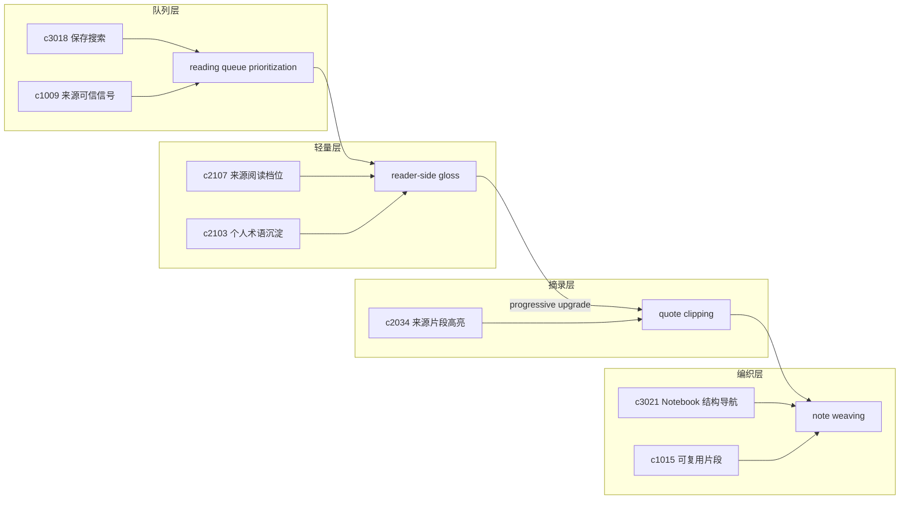

## Why

阅读过程中产生的理解有不同重量：有些只是页边一闪而过的想法，有些值得摘为正式引用，有些需要逐步升级成笔记的一部分。目前系统对"阅读时产生的轻量理解"和"正式的摘录—编织流程"分开处理，用户要么被迫在两个入口之间跳转，要么把有价值的页边想法丢掉。

需要把**阅读侧的完整工作流**——从阅读优先级和引导顺序，到页边 gloss，到渐进升级的 annotation，再到正式的 quote clipping 和 note weaving——统一为一条连续路径。来源一多，"先读哪份最划算"是第一个问题；进入阅读后"怎么记"是第二个问题。二者合在一起才构成完整的阅读工作面。

> 合并说明：本提案合并了原 `reader-side-glosses-and-progressive-annotations`、`reading-queue-prioritization-and-guided-order` 的全部内容。

## What Changes

### 0. 阅读队列优先级与引导顺序（reading queue prioritization & guided order）

- 定义 reading queue prioritization，根据主题、缺口、可信度和重复风险给出阅读顺序建议
- 增加 guided order，区分"先建立全貌""先补关键缺口""先验证争议点"等阅读路径
- 让用户能手动调序、跳过和标记已消化，避免自动排序压过个人判断
- 支持把阅读队列与 source pack、saved search 和 evidence gap 互通

### 1. 阅读页边注（reader-side gloss）

- 在来源阅读器中支持轻量边注和短解释，不进入正式 notebook
- gloss 与术语解释、双语对照和阅读档位联动
- 区分私人阅读批注和正式可复用笔记，避免界限模糊

### 2. 渐进式批注升级（progressive annotation）

- 边注按重要程度逐步升级：gloss → quote → notebook block
- 升级时自动继承来源锚点、上下文和 citation anchor
- 升级 lineage 可追溯（知道某条笔记从哪条边注发展而来）

### 3. 摘录剪贴（quote clipping）

- 定义 quote clipping，让用户从来源片段直接收成可追溯的摘录对象
- 摘录对象天然带 citation anchor 和上下文，无需二次手工补链
- 支持从阅读队列、来源详情和引用修复入口快速创建摘录

### 4. 笔记编织（note weaving）

- 把摘录、个人批注和 notebook block 组织成一个连续编织过程
- 编织链路保留引用继承关系，确保最终笔记的每一段都可回溯到来源

## Capabilities

### New Capabilities

- `reader-side-glosses-and-progressive-annotations`: 定义阅读页边注和渐进式批注升级。
- `quote-clipping-and-note-weaving`: 定义摘录对象、摘录到笔记的编织链路和引用继承规则。
- `reading-queue-prioritization-and-guided-order`: 定义来源阅读优先级、推荐顺序和消化状态。

### Modified Capabilities

- `source-reading-modes-and-density-controls`: 阅读档位需要控制边注显示强度。
- `personal-glossary-growth-and-term-settling`: 术语解释需要能从边注沉淀。
- `source-segment-highlighting-and-inline-notes`: 片段高亮需要能直接生成摘录。
- `notebook-outline-backlinks-and-structural-navigation`: 结构导航需要识别摘录与原来源的反链。
- `notebook-fragments-and-reusable-snippets`: 可复用片段需要能消费摘录对象。
- `saved-searches-smart-filters-and-follow-lists`: 保存搜索需要能直接进入阅读队列。
- `source-trust-signals-and-quality-hints`: 可信信号需要参与阅读优先级。
- `source-pack-assembly-and-topic-watchlists`: 来源包需要能生成面向阅读的顺序视图。

## Impact

- Backend：边注对象、升级 lineage、摘录对象模型、锚点继承和 block 关联关系。
- Frontend：来源阅读器边注层、升级动作入口、笔记编写区和引用插入流程。
- Dependencies：承接 `c2107`（来源阅读档位）、`c2103`（个人术语沉淀）、`c2034`（来源片段高亮）、`c3021`（Notebook 结构导航）、`c1015`（可复用片段）。

## Dependency Sketch

