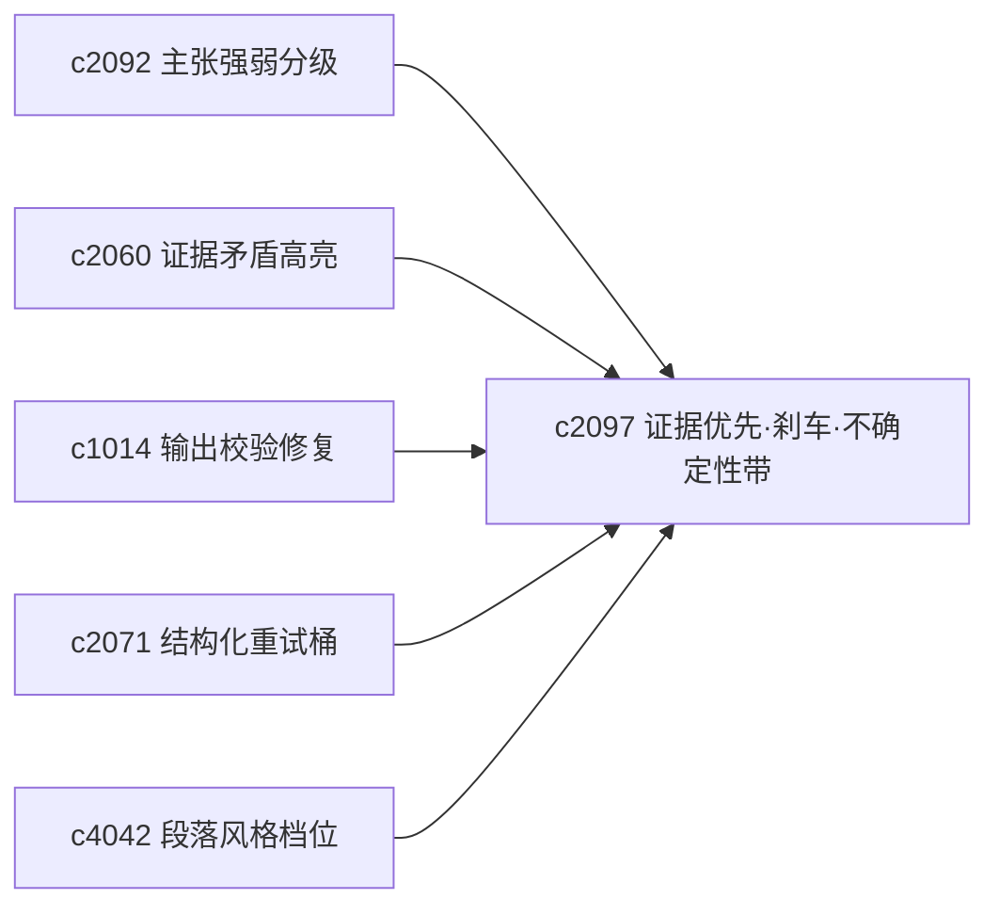

## Why

偏研究型输出最怕的不是生成慢，而是**生成太顺、太敢说**：已有引用、修复与重试，但仍需明确的「先证据、后结论」保守模式。与此同时，用户需要的不是永远“看起来完整”的答案，而是能感知**把握程度**——仅有主张强弱与风险刹车仍不够，还应在答案、段落或主张层表达不确定性，并让语气与结构贴合证据成熟度，且可被人为覆盖，避免系统替用户装得过分保守或过分肯定。

> 合并说明：本提案合并了原 `uncertainty-bands-and-answer-confidence-shaping` 的全部内容。

## What Changes

1. **证据优先生成与高风险刹车**：定义 evidence-first generation mode，生成前优先锁定可用证据与主张强弱；增加 unsafe claim brake，对高风险跳跃、证据不足与过度确定语气拦截或降级；按输出类型切换保守程度；刹车结果进入修复、复核与 postmortem，而非单次弹窗。
2. **不确定性带与信心塑形**：定义 uncertainty band，在答案/段落/主张层表达把握较高、暂时性判断、明显待补证等层级；增加 confidence shaping，使输出语气与结构贴合证据成熟度；不确定性同时作用于 briefing、report、one-pager；支持用户覆盖默认表达策略。

## Capabilities

### New Capabilities

- `evidence-first-generation-modes-and-unsafe-claim-brakes`：证据优先生成模式与高风险主张刹车。
- `uncertainty-bands-and-answer-confidence-shaping`：不确定性带与答案信心塑形。

### Modified Capabilities

- `evidence-contradiction-highlights-and-resolution-notes`：矛盾证据影响保守模式。
- `output-validation-repair-and-self-heal`：区分格式问题与主张风险。
- `structured-generation-retry-buckets-and-error-taxonomy`：增加高风险表达桶。
- `claim-strength-grading-and-evidence-weight`：主张强弱传递到输出表达层。
- `section-style-profiles-and-tone-guards`：章节风格档位容纳不同信心表达。（`c4042` 等相关档位需协同）

## Impact

- **Backend**：生成前校验、风险分级、重试策略、输出元数据与表达策略/语气建议。
- **Frontend**：生成配置、风险提示、复核视图、段落标签与阅读感知。
- **Dependencies**：把 `c2060`、`c1014`、`c2071` 向更可信输出再推一层；并与 `c2092`、`c4042` 等串联最终表达。

## Dependency Sketch

