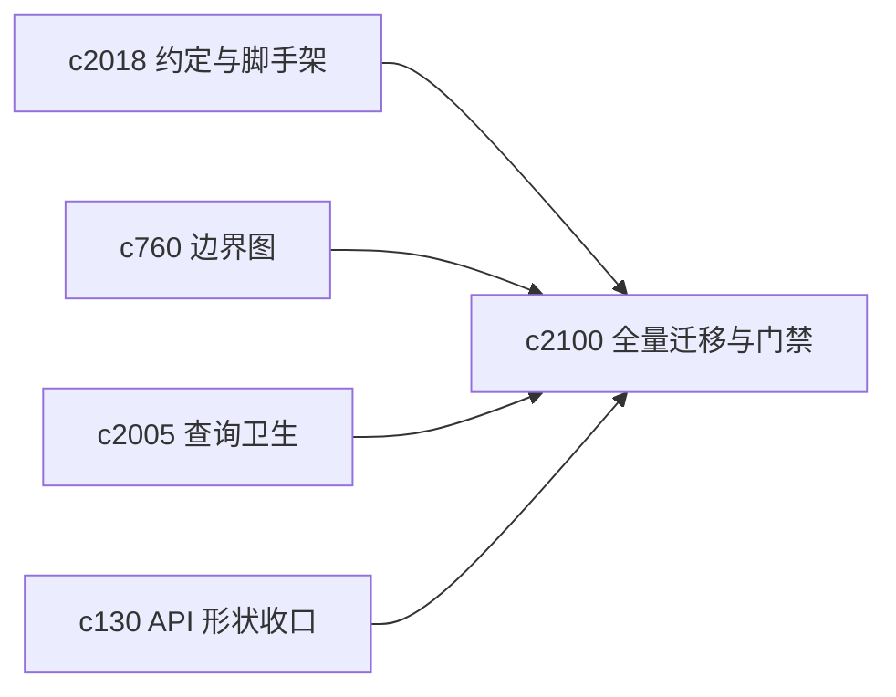
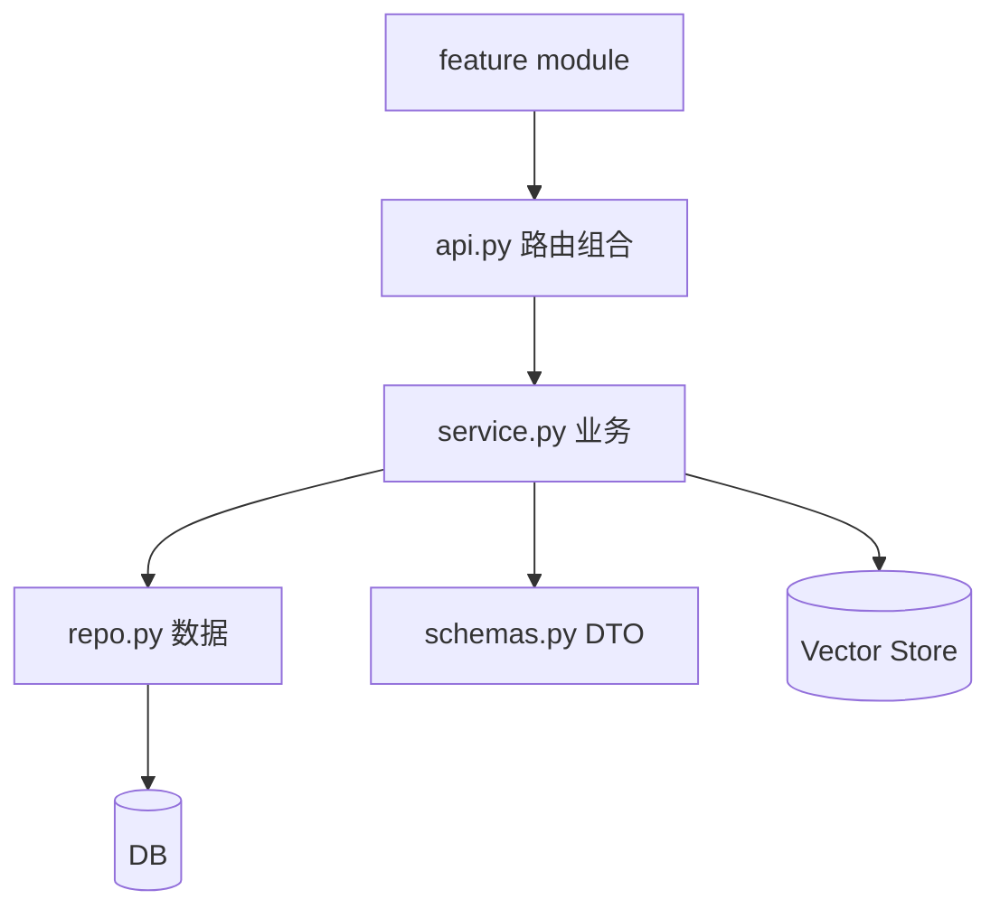

## Why

后端的 feature 组织已经有“分层”的意识，但落地方式不统一：有的按 `api/service/repo/schemas` 拆得很清楚，有的把业务逻辑塞在路由里，有的又拆成一堆 `api_*.py`。短期能跑，长期就会变成两件事：

1) 排查问题越来越靠“谁熟”。
2) 重构越来越不敢动，怕牵扯太广。

`c2018` 已经把“理想结构”和 lint/scaffold 的方向写清楚了。这条提案更像一次收口动作：不再让新旧写法长期并存，直接把现有模块一次性对齐到同一套约定上。

## What Changes

- 全量迁移后端 feature 到统一结构（一次性升级旧写法，不做兼容分叉）：
  - `api.py`：只做路由组合与依赖注入，不放业务逻辑
  - `service.py`：业务逻辑与事务边界
  - `repo.py`：查询/持久化与查询形状收口（对齐 `c2005`）
  - `schemas.py`：Pydantic DTO / OpenAPI 形状（对齐 `c130/c2017`）
- 收敛路由文件：把碎片化的 `api_*.py` 合并成更清晰的“按资源/场景分组”的路由模块（仍由 `api.py` 统一注册）。
- 增加一致性门禁（gates）：
  - 对新增/改动模块强制通过（旧模块渐进迁移，不要求一口气清零）
  - 规则报错尽量能给出“应该挪到哪里”的提示，而不是只说不准
- 顺带把“跨 feature 直接 import 私有实现”的行为显式化：要么走 `service`，要么下沉 `shared/`，不要靠“顺手就用”。

## Capabilities

### New Capabilities

- `backend-feature-module-migration-sweep-and-consistency-gates`: 全量迁移既有模块到统一约定，并提供一致性门禁。

### Modified Capabilities

- `backend-feature-module-conventions-and-scaffolding`（`c2018`）：从“约定/脚手架”推进到“全量对齐/门禁执行”。
- `module-boundary-map-and-dependency-pruning`（`c760`）：边界图与可执行规则需要互相校验。

## Impact

- Backend：模块结构更稳定，代码 review 更省口水，后续做重构不再像拆盲盒。
- Risk：一次性迁移会触达文件路径与 import 关系；需要先从改动最频繁的模块开刀，避免长尾拖太久。

## Dependency Sketch

