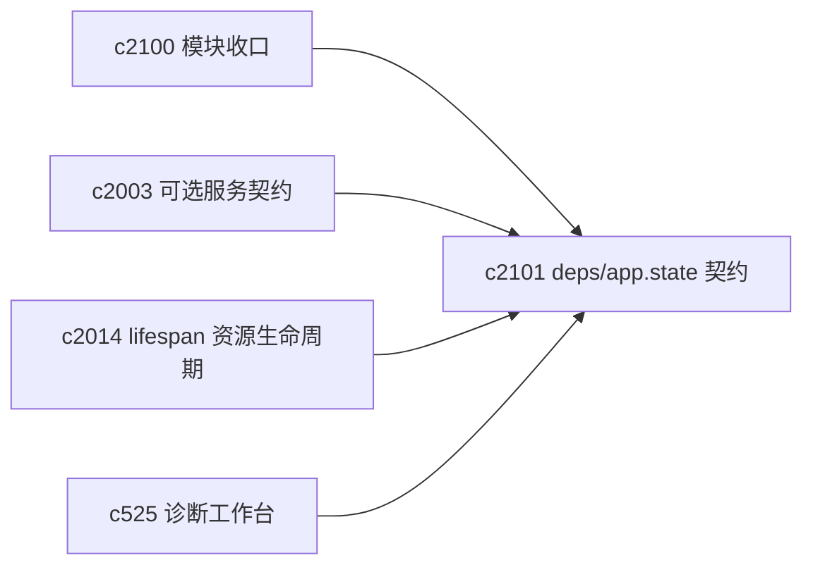
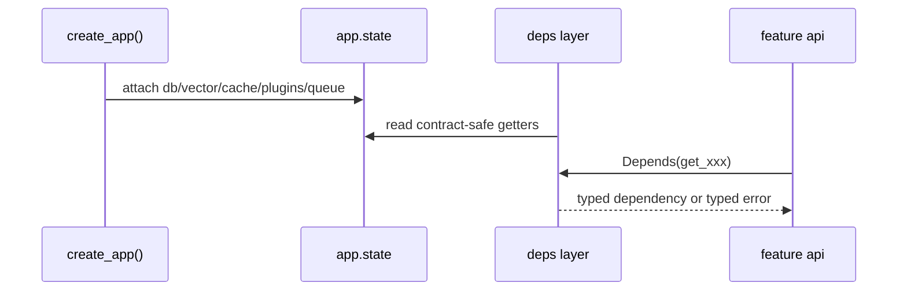

## Why

`create_app()` 现在能把 DB、vector store、cache、插件、任务队列都装配起来，但这些对象的“边界和生命周期”信息散在好几个地方：一部分在 `app.state`，一部分在 deps，一部分在 worker 启停逻辑里。要做任何一件维护向的事（诊断、替身注入、可选服务降级、测试装配）都会遇到同一个问题：你得先把上下文凑齐。

我更希望它像一个明确的合同：哪些东西必须有、哪些可选、谁负责 close、缺了会报什么错误码、用户能看到什么提示。

## What Changes

- 定义后端 `AppState`/deps 的最小契约（Contract）：
  - `settings/db/vector_store/cache/plugins/task_queue/limiters` 等核心对象的存在性与类型边界
  - 生命周期责任：谁创建、谁关闭、在哪个 lifespan 阶段发生
- 统一 deps 注入方式与错误表达：
  - “缺依赖/不可用”不再靠临时字符串，走统一错误码（对齐 `c2102`）
  - 可选服务（Chroma/Redis/Ollama/SearxNG）状态以同一套结构对外（对齐 `c2003`）
- 支持更干净的替身注入：
  - 用于集成测试、诊断模式、离线模式（比如 vector store 走 memory/sqlite 的最小闭环）

## Capabilities

### New Capabilities

- `backend-deps-and-app-state-contract`: 明确后端装配与 deps 的契约、生命周期与失败语义。

### Modified Capabilities

- `app-lifespan-resource-lifecycle-and-shutdown-safety`（`c2014`）：把“关得干净”变成可验证的规则。
- `optional-services-readiness-contract`（`c2003`）：把可选服务状态纳入统一 deps 语义。
- `dev-diagnostics-workbench-and-state-dumps`（`c525`）：诊断面需要有稳定的状态入口。

## Impact

- Backend：依赖注入更清晰，调试与测试更轻，后续做降级/回滚不会靠“猜”。
- Risk：改动会触达多个 feature 的 deps 使用方式，需要配合 `c2100` 的模块收口避免越改越散。

## Dependency Sketch

