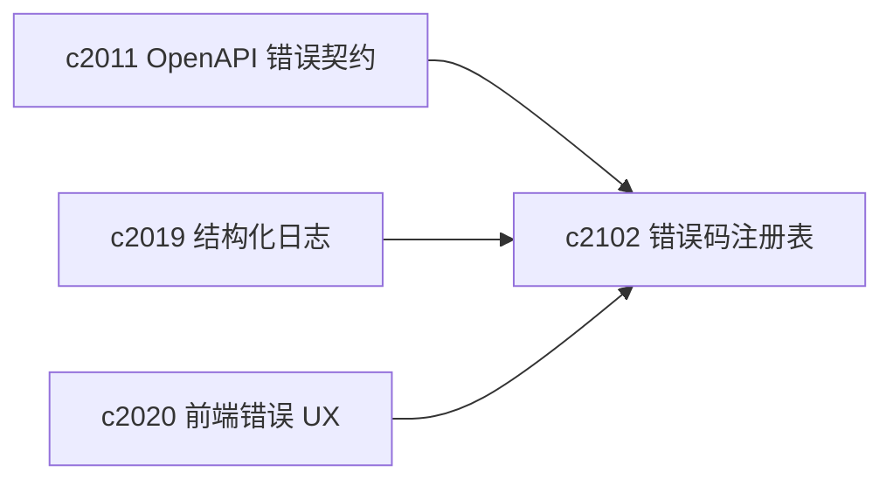

## Why

后端已经有统一的错误响应构造（例如 `build_error_response`），但“错误码、提示语、是否可重试、用户应该怎么自救”还没有变成一个可复用的系统。结果就是：

- 前端常常只能显示一句“失败了，请重试”，但其实很多错误是可修复的（缺依赖、配置缺项、连接器 preflight 没过）。
- 日志里出现大量一次性字符串，聚合与统计很痛。
- 新 endpoint 很容易自己发明一套 `detail` 形状，最后把前端逼成“到处判类型”。

这条提案的目标很朴素：把错误当成产品界面的一部分，而不是异常堆栈的副产物。

## What Changes

- 建立后端 error code registry（单一真相）：
  - `error_code` → 默认 message、hint、是否可重试、建议动作
  - 明确哪些错误是“配置问题”、哪些是“外部依赖不可用”、哪些是“用户输入不合法”
- 固定 `/v1/**` 的错误响应形状：
  - 让 `detail` 从“字符串/对象混用”收口为同一套结构
  - OpenAPI 文档同步这个错误形状（对齐 `c2011`）
- 加一层 enforcement：
  - 未注册 `error_code` 的错误不允许直接出现在用户侧响应里（开发期可保留 debug 信息，但要有边界）

## Capabilities

### New Capabilities

- `error-code-registry-and-api-error-shape-enforcement`: 错误码注册表 + 错误形状收口 + 强制门禁。

### Modified Capabilities

- `openapi-error-contract-and-doc-gates`（`c2011`）：错误契约需要落到可执行门禁。
- `structured-logging-schema-redaction-and-error-sampling`（`c2019`）：错误码成为日志聚合的主键之一。
- `frontend-error-ux-and-recovery-actions-unification`（`c2020`）：前端错误 UX 可直接消费 `hint/retry_after`。

## Impact

- Backend：新增/改造 endpoint 时不再“临时拼字符串”；错误的可读性更一致。
- Frontend：可以按 `error_code` 做更像产品的提示与动作（比如“去配置”“去重连”“重试”）。
- Risk：需要避免过度设计 registry；先覆盖最常见的 30-50 个错误码就够用，别追求一次封神。

## Dependency Sketch



```mermaid
flowchart TD
  X[Exception/ValidationError] --> M[Error mapper]
  M --> R[Registry lookup]
  R --> E[ErrorResponse {error_code,message,hint,...}]
  E --> FE[Frontend render + actions]
```
