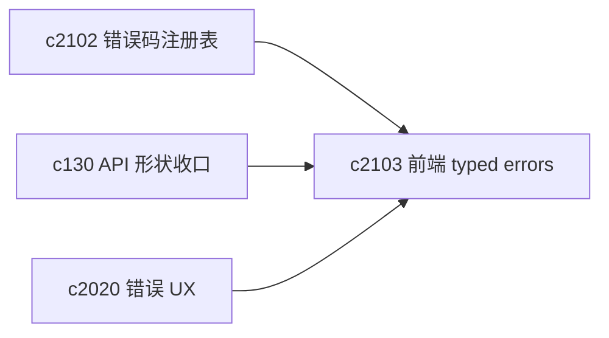
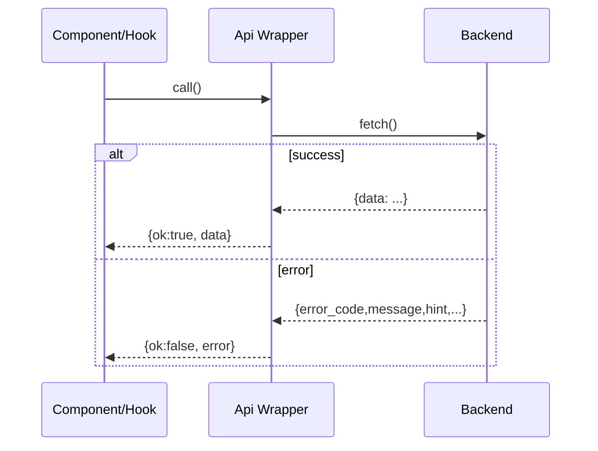

## Why

前端的 API client 是生成的，能用，但现在对错误的表达还比较粗：`throwOnError` 一开，抛出来的东西类型不稳定；不开，又容易在调用处“各写各的 catch”。更直白一点：这会把 UI 写成“到处都是 try/catch + toast”。

生成代码里已经留了 TODO（`client.gen.ts`）——这不是小修小补能解决的问题，最好把“稳定调用口”明确下来：成功返回什么，失败返回什么，组件拿到错误后应该怎么渲染。

## What Changes

- 在生成 client 外包一层“稳定 API 调用口”：
  - 返回 `Result<TData, ApiError>` 或等价结构（重点是可判定、可渲染）
  - `ApiError` 至少包含 `error_code/message/hint/retry_after/request_id`（对齐 `c2102/c2105`）
- 统一拦截器策略：
  - 401/429/5xx 的默认处理与提示语言一致
  - 网络断开/后端不可达时，直接返回可显示的错误对象（不把异常抛到组件里）
- 让 domain hooks 不再关心“怎么解析错误”，只关心“把错误交给 UI”。

## Capabilities

### New Capabilities

- `frontend-api-client-wrapper-and-typed-errors`: 前端稳定调用口与错误类型收口。

### Modified Capabilities

- `api-shape-consolidation-and-generated-client-slimming`（`c130`）：生成 client 与错误形状需要一致。
- `frontend-error-ux-and-recovery-actions-unification`（`c2020`）：错误 UX 能基于 error_code 做统一动作。

## Impact

- Frontend：调用处更干净；错误展示更像产品；后续做重试、提示、引导都更顺手。
- Risk：需要小心“新 wrapper”和“旧直连生成 client”并存太久；最好配合 `c2104` 统一数据获取方式。

## Dependency Sketch

