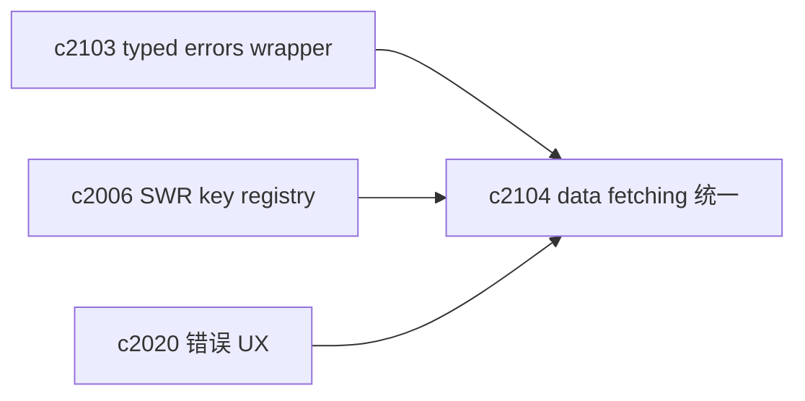
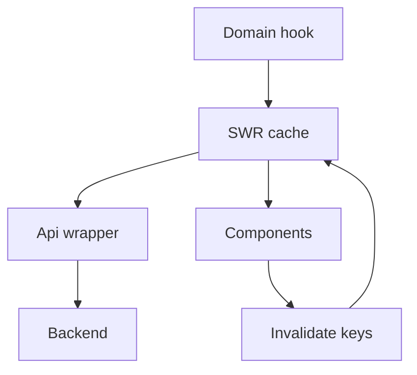

## Why

workspace 各 domain 的数据获取方式现在偏“手写”：`useState + useEffect + try/catch` 很快，但只要模块一多，就会出现这些小差异：

- 有的会缓存，有的每次都打请求
- 有的会在断线时给出提示，有的静默失败
- 有的错误文案更像开发信息，有的更像用户信息

我们已经有 `c2006`（SWR key registry / invalidation）的方向，这条提案做的是“把它用起来”：让同一类问题只解决一次。

## What Changes

- 建立统一的 data fetching 约定：
  - domain hook 一律走同一套缓存/重试/失效策略（基于 `c2006`）
  - hook 只返回结构化状态（`data/loading/error`），文案与动作由 UI 层统一负责
- 把“连接状态 gating”做成通用层：
  - 未连接/后端不可用时，所有 domain 行为一致（对齐 `c2020`）
- 逐步替换现有手写 hooks（从 analysis/sources/outputs 这类高频域开始）。

## Capabilities

### New Capabilities

- `frontend-data-fetching-standardization-and-swr-adoption`: 统一数据获取、缓存与失效规则。

### Modified Capabilities

- `frontend-swr-key-registry-and-invalidation`（`c2006`）：从“registry”推进到“强制使用”。
- `frontend-error-ux-and-recovery-actions-unification`（`c2020`）：错误展示与恢复动作收口。

## Impact

- Frontend：可预期的加载/错误行为；减少重复代码；性能问题更容易定位。
- Risk：迁移会触及不少 hooks；需要配合 `c2103` 把错误类型先稳定下来，避免边迁边改接口。

## Dependency Sketch

