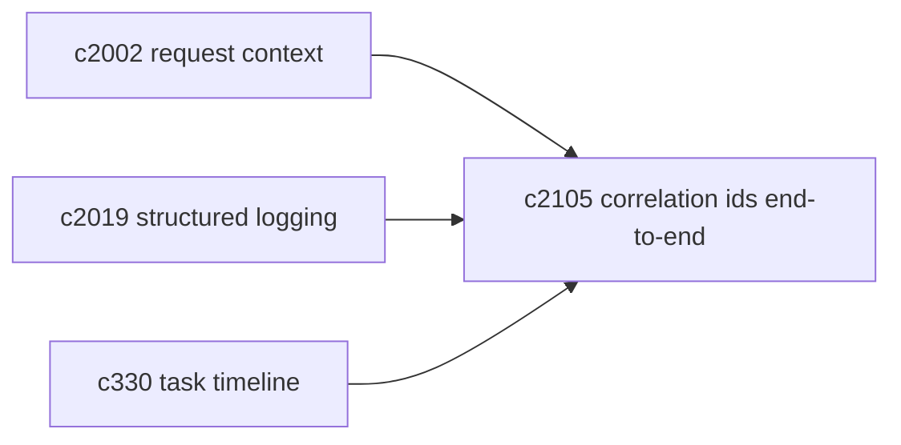
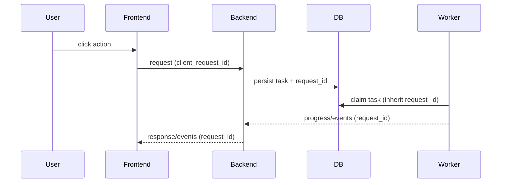

## Why

排查问题时最常见的断点是：我在 UI 点了一个动作，后端到底做了哪几步？有没有创建任务？worker 跑到哪里失败了？如果没有贯穿的 request/task id，大家就只能靠时间戳猜。

对个人用户来说也一样：当它偶尔“卡住”，你至少想知道它是在检索、在生成，还是根本没发出请求。

## What Changes

- 前端为每次“会触发后端工作”的动作生成 `client_request_id`，写入请求头。
- 后端接收后：
  - 写入结构化日志（对齐 `c2019`）
  - 如果触发 task，把这个 id 写进 Task 记录，worker 继承并继续输出
- UI 提供最小但实用的能力：
  - 一键复制 trace id（用来提 issue 或自己对账）
  - task 详情里展示同一条链路的关键节点

## Capabilities

### New Capabilities

- `correlation-ids-end-to-end-from-browser-to-worker`: 从浏览器到 worker 的链路追踪 id。

### Modified Capabilities

- `request-context-and-correlation-ids`（`c2002`）：把“后端内部 id”扩展到端到端。
- `task-feed-compaction-and-event-timeline`（`c330`）：timeline 需要能挂上 trace id。
- `structured-logging-schema-redaction-and-error-sampling`（`c2019`）：日志聚合主键更明确。

## Impact

- Debug：定位问题从“翻日志”变成“按 id 追一条链路”。
- Product：用户看到的“卡住”会更少；就算卡住也更容易解释。

## Dependency Sketch

