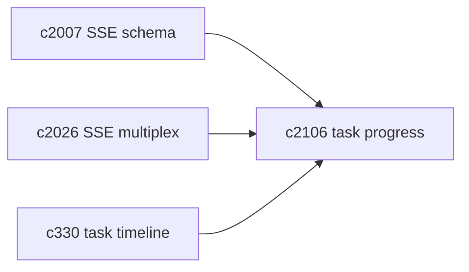
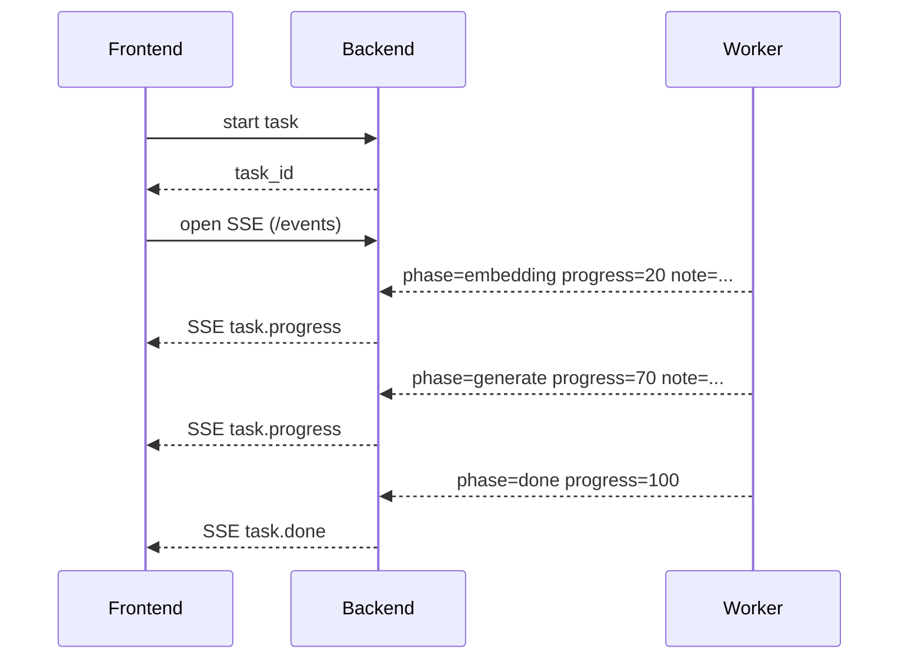

## Why

现在的任务进度更多是 0/100。用户看到的就是“开始了”和“结束了”，中间那段时间全靠猜；开发排查也是一样：慢在哪里、卡在哪里、是限流还是外部依赖慢，都不清楚。

我想先把“它正在做什么”说清楚，再谈更复杂的恢复、重试、断点续跑。

## What Changes

- 定义 task phase 模型（最小可用版）：
  - queued / claimed / embedding / retrieval / generate / postprocess / done
  - 每个 phase 都能给出 `progress`（粗粒度也行）和 `note`（短句）
- 通过 SSE 推送进度事件到前端（对齐 `c2007/c2026`）：
  - 前端任务面板展示 phase 与最新 note
  - 断线重连时能拉到最近一段事件（避免 UI 变成空白）
- 与 limiter 联动：
  - 当 embedding/vector_search/llm_generate 被限流时，phase 能显示“在等配额”，别让人误以为挂了

## Capabilities

### New Capabilities

- `task-phase-breakdown-and-progress-events`: 任务阶段拆分与进度事件推送。

### Modified Capabilities

- `sse-event-schema-and-stream-client`（`c2007`）：需要覆盖 task progress 事件类型。
- `frontend-sse-connection-multiplexing-and-resource-guards`（`c2026`）：多流并发下的资源保护。
- `task-feed-compaction-and-event-timeline`（`c330`）：任务事件要能沉淀为 timeline。

## Impact

- UX：长任务更可预期；用户更敢等，也更敢停。
- Engineering：性能与稳定性问题更容易被定位到“阶段”。
- Risk：phase 过细会变成噪音；先用 6-8 个阶段就够用。

## Dependency Sketch

