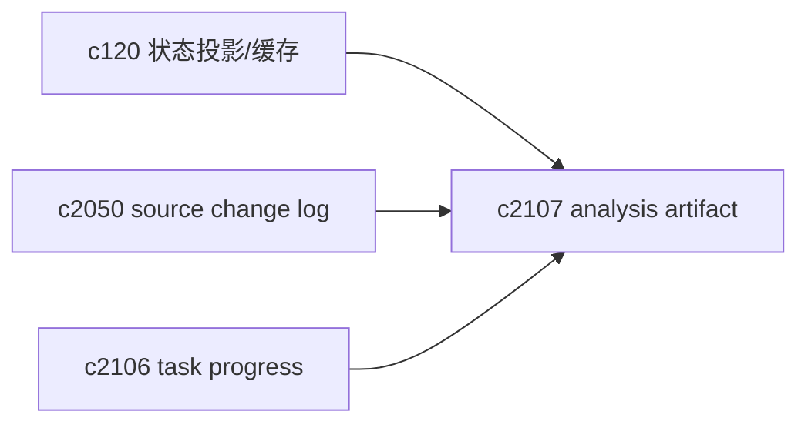
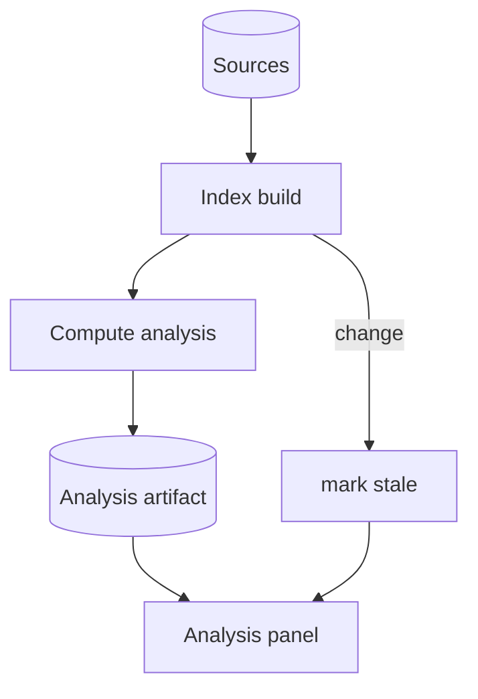

## Why

`/analysis` 现在是“现算现出”。当分析逻辑变复杂（聚类、关系、矛盾检测），它就会变成一个昂贵且不稳定的按钮：你点一次它跑一遍，刷新一下又跑一遍；来源一变，它又默默变得过期，但用户看不出来。

更自然的形态是把分析当成 notebook 的一种“产物（artifact）”：有版本、有生成时间、有基线，必要时可刷新，但不会随手就消失。

## What Changes

- 将 `AnalysisResult` 存为 notebook artifact：
  - `analysis_snapshot_id`、`generated_at`、基于的 `index_revision/source_snapshot`
  - 状态：fresh / stale / failed（失败也要留原因）
- 增加轻量缓存策略：
  - 同一基线重复请求直接返回 artifact
  - 来源/索引变化时标记 stale，但不强制重算（由用户决定什么时候刷新）
- 把“为什么分析不可用”说清楚：
  - 没有可用 chunk、索引未完成、模型不可用等，都走统一错误码（对齐 `c2102`）

## Capabilities

### New Capabilities

- `analysis-as-artifact-and-cache`: 分析结果的产物化、缓存与过期语义。

### Modified Capabilities

- `workspace-state-projection-and-summary-cache`（`c120`）：artifact 需要进入状态投影。
- `source-change-log-and-delta-indexing-planner`（`c2050`）：判断 stale 的依据来自 source change log。

## Impact

- UX：分析结果可复用，刷新更可控；用户更容易形成“看图→回证据→再刷新”的节奏。
- Backend：需要一个 artifact 存储与基线引用；但收益是减少重复计算与不确定性。

## Dependency Sketch

