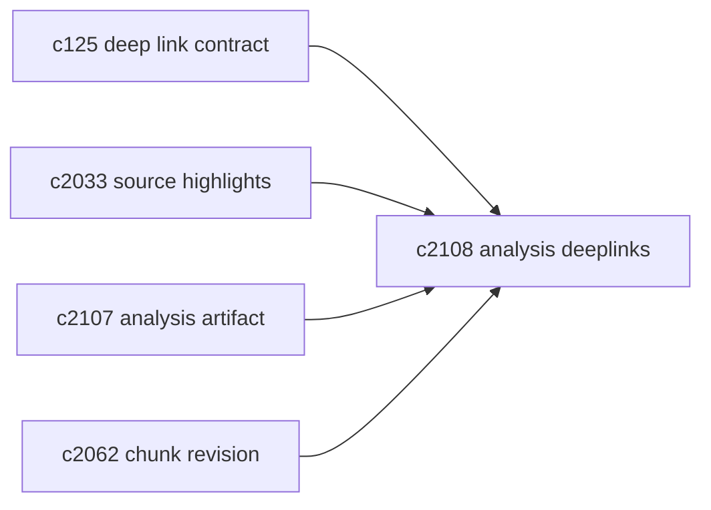
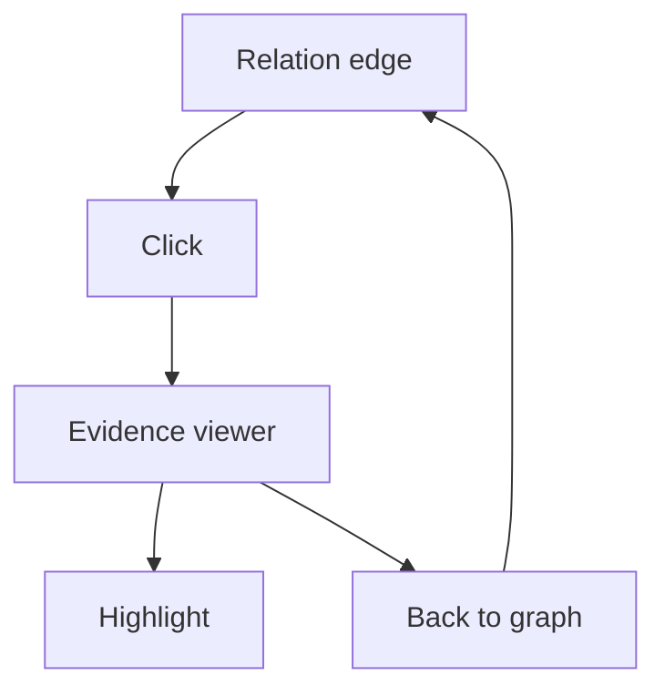

## Why

分析面板已经能把 topics/relations/contradictions 展示出来，但它更像“概览”：看完你还是得自己去找证据片段。对个人研究来说，这一步太耗心力——也会让“分析”变成一次性的烟花。

这条提案只做一件事：让图上的每一个 chunk id 都能把你带回证据，并且能回得来。

## What Changes

- 为 analysis 图建立 deeplink：
  - chunk 节点 → 来源查看器定位（页码/段落）并高亮
  - relation 边 → 双侧证据并排查看（对齐 `c740` 的阅读模式方向）
- 增加常用筛选与回链：
  - 只看冲突、只看高相似、按 topic 聚合
  - 在证据查看器里能“一键回到这条边/这个 topic”
- 把链接契约做成可复用组件：
  - 不止 analysis，后续 citations、timeline、briefing 都能复用同一套“证据定位”能力

## Capabilities

### New Capabilities

- `analysis-graph-deeplinks-and-chunk-navigation`: 分析图到证据的深链与导航。

### Modified Capabilities

- `cross-panel-selection-and-deep-link-contract`（`c125`）：深链契约需要覆盖 chunk 定位。
- `citation-span-mapping-and-source-viewer-highlights`（`c2033`）：高亮能力复用到 analysis。
- `analysis-as-artifact-and-cache`（`c2107`）：deeplink 的基线来自 artifact。

## Impact

- UX：分析从“看一眼”变成“可用的导航工具”。
- Risk：需要处理“chunk 被重切分导致 id 变化”的情况；这依赖 `c2062` 的 revision 语义。

## Dependency Sketch

