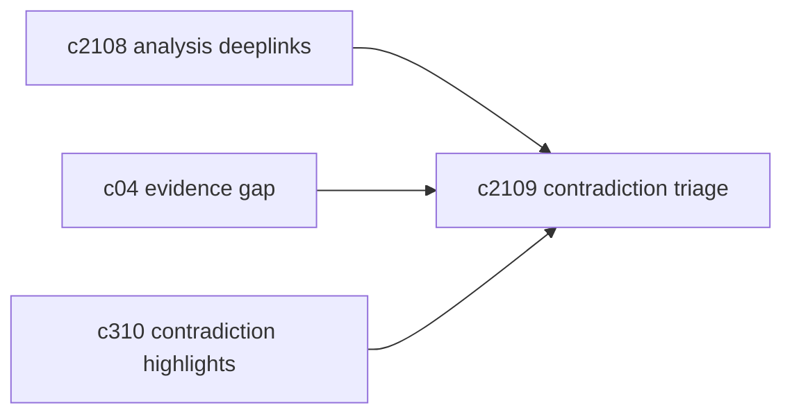
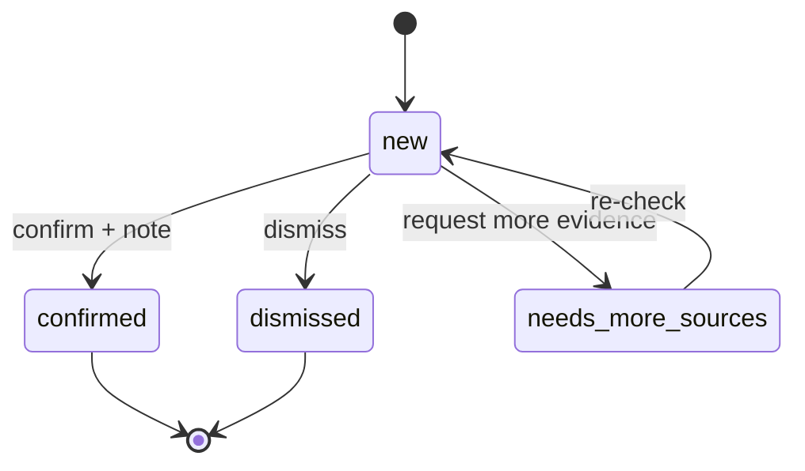

## Why

“检测到矛盾”只是一个信号。没有后续处理流，它很快会变成噪音：你点开看一眼，觉得有意思，然后就没然后了。对个人使用来说更明显——你需要的是一个轻量的整理动作，而不是一套团队审批流程。

这条提案把矛盾当成一种可推进的工作项：能确认、能忽略、能标记需要补证据。

## What Changes

- 建立 contradiction triage 的最小状态与动作：
  - 状态：new / confirmed / dismissed / needs_more_sources
  - 动作：绑定证据片段、写一句备注、导出为 notebook note
- 与补证据联动（不做自动抓取）：
  - 标记 `needs_more_sources` 后，给出建议检索词/补源方向（对齐 `c04` 的 evidence gap）
- 在 UI 里把“矛盾列表”做成一个轻量队列：
  - 支持排序/筛选/快速处理，别让用户每次都从头翻

## Capabilities

### New Capabilities

- `contradiction-triage-workflow`: 矛盾条目的整理、标注与导出流程。

### Modified Capabilities

- `evidence-gap-and-claim-checking`（`c04`）：needs_more_sources 的建议来源于 gap 逻辑。
- `evidence-contradiction-highlights-and-resolution-notes`（`c310`）：矛盾展示与备注需要能沉淀。
- `analysis-graph-deeplinks-and-chunk-navigation`（`c2108`）：triage 必须能一键回证据。

## Impact

- UX：矛盾不再是“看过就算”，能变成个人复盘的素材。
- Risk：别把流程做重；两三个按钮能解决的事，不要引入复杂表单。

## Dependency Sketch

