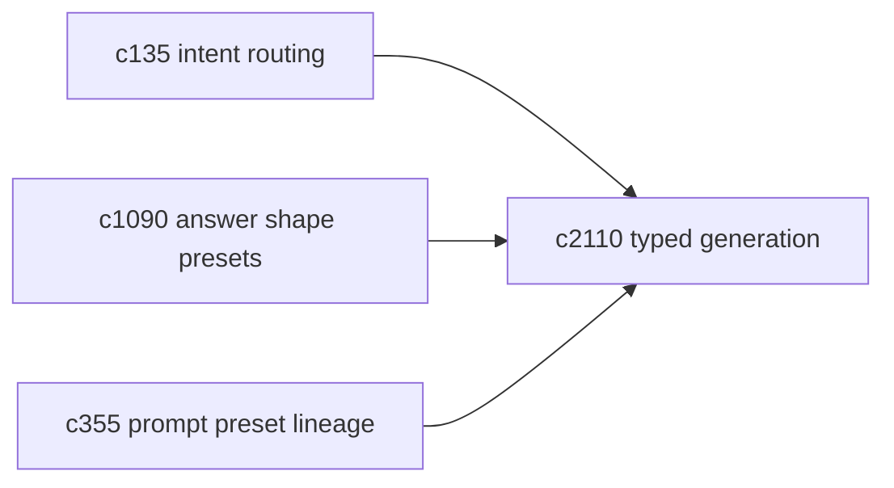
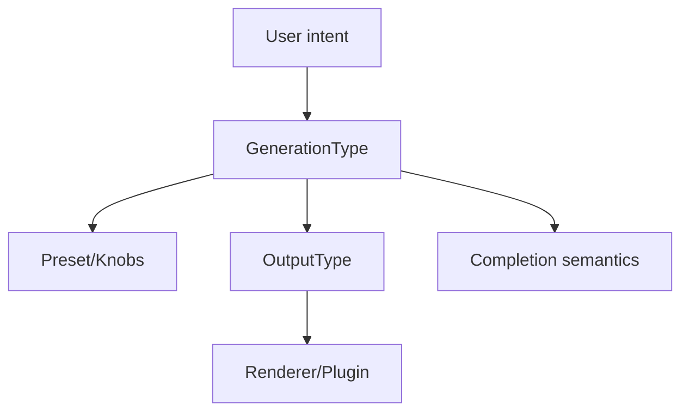

## Why

现在系统里“输出类型”（slides/briefing/quiz…）已经有了插件与渲染闭环，但“这次生成到底在做什么”（研究、综合、问答、发散写作）还没有一个稳定的合同。两者混在一起，会导致几个很实际的问题：

- prompt、检索策略、引用要求被输出类型绑死，换一种承载方式就要重新发明一遍。
- “完成语义”不清晰：什么时候算完成，什么时候只是草稿，什么时候必须有引用。
- 后续加能力时容易长出特例：每个输出插件都想做自己的路由与控制面，越走越散。

这条提案把概念拆开：输出类型负责承载与渲染；生成类型负责输入要求、证据策略、控制面与完成语义。

## What Changes

- 定义 `GenerationType` 最小契约（最小可用版，先别做大）：
  - input requirements：最少来源、是否必须用户 prompt、证据模式
  - output contract：兼容的输出类型、默认输出、结构化 schema（可选）
  - control surface：可调 knobs + 默认 preset（对齐 `c2111`）
  - completion semantics：是否必须 citation、适用质量门（对齐 `c2114`）
- 明确映射关系：
  - 一个 GenerationType 可以对应多个 OutputType，但不是任意组合
  - intent routing：给定用户意图 → 选 GenerationType → 选默认 OutputType
- 把 framework 放在“公共层”，下游只扩展，不回写特例。

## Capabilities

### New Capabilities

- `typed-generation-framework-minimal-contract`: 生成类型契约、映射与路由框架。

### Modified Capabilities

- `answer-shape-presets-and-output-landing-zones`（`c1090`）：输出落点需要与 GenerationType 对齐。
- `prompt-preset-lineage-and-migration`（`c355`）：preset 的版本化与迁移要接入生成框架。
- `command-intent-routing-and-action-composition`（`c135`）：意图路由需要能落到 GenerationType。

## Impact

- Backend：路由/装配层更清晰，检索与生成策略能复用。
- Frontend：工具入口可以按 GenerationType 组织，而不必只按 OutputType 堆按钮。
- Risk：别一开始就把类型做太多；先做 3-4 个最常用的（research/synthesis/qa/creative）就够。

## Dependency Sketch

