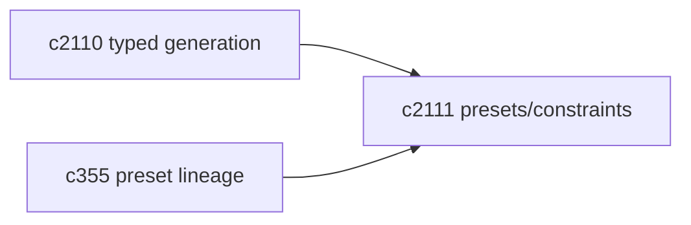
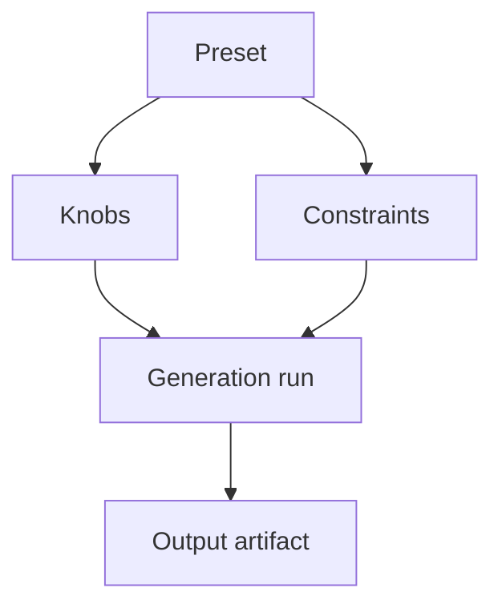

## Why

个人工作台里，最常见的需求不是“我想生成一次”，而是“我想一直用同一种口味生成”。如果每次都要手写一堆要求（长度、结构、引用密度、语气），很快就会疲劳；而且你写得再认真，也很难稳定复现。

这条提案把这些偏好收成 preset：可选、可复用、可版本化。它不会替代 prompt，只是把“重复劳动”搬走。

## What Changes

- 定义 preset schema（先覆盖最常见的那一撮）：
  - 目标长度、结构模板、引用密度、语气、允许/禁止无证据段落
  - 约束：必须字段、禁止字段（避免生成结果无法渲染）
- preset 与 `GenerationType` 绑定：
  - 不同生成类型暴露不同 knobs（别让用户面对无意义选项）
  - 默认 preset 可由系统提供，也允许用户自建
- preset 版本化：
  - 改动 preset 不“悄悄影响旧结果”，而是有迁移/回放语义（对齐 `c355`）

## Capabilities

### New Capabilities

- `generation-presets-and-constraints`: 生成 preset、knobs 与约束模型。

### Modified Capabilities

- `typed-generation-framework-minimal-contract`（`c2110`）：preset 是控制面的核心组件。
- `prompt-preset-lineage-and-migration`（`c355`）：preset 演进需要可追溯。

## Impact

- UX：一键复用个人偏好，结果更稳定。
- Engineering：评测/回归更容易固定输入面；减少“感觉变了但说不清”的争论。

## Dependency Sketch

