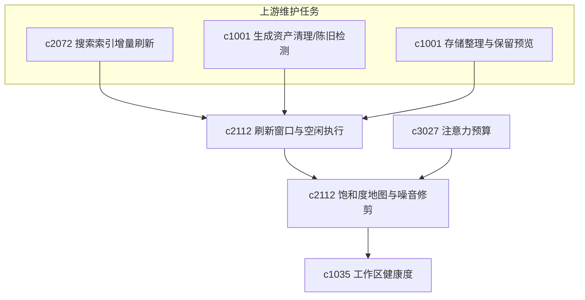

## Why

大量刷新、预热与轻量整理不必打断当前操作，更适合在用户空闲窗口内安静完成；但后台任务一多，真正扰人的往往不是单个任务，而是整体噪音与密度难以感知，用户既需要**何时做**的策略，也需要**哪里太吵、该收口什么**的地图。本变更把「空闲调度」与「饱和度可视 + 噪音修剪」放在同一条后台工作管理线里，目标仍是本地个人工作区的轻运维，而非通用后台自动化平台。

## What Changes

### 1. 后台刷新窗口（background refresh window）

- 将来源刷新、索引预热、轻量整理等安排到用户空闲或可接受的时段。
- 支持安静窗口、暂停条件与资源上限，保留个人掌控感。

### 2. 空闲执行语义（idle execution）

- 明确低优先级维护任务如何在不干扰主工作流的前提下执行。
- 与索引增量刷新、生成物清理、存储整理等能力对齐调度契约。

### 3. 饱和度地图（saturation map）

- 将后台刷新、整理、清理与观察类任务的**时间/资源密度**可视化，回答「哪里太吵」。
- 结果可回接空闲执行策略、注意力预算与健康度，形成闭环摘要。

### 4. 噪音修剪（noise pruning）

- 帮助用户裁掉当前阶段价值不高的后台动作，减少干扰。
- 强调「减少打扰」而非建设复杂调度中心。

### 5. 边界与原则

- 避免滑向长期全自动运维平台；能力范围限定在个人工作区的可解释后台行为。

## Capabilities

### New Capabilities

- `background-refresh-windows-and-idle-execution`：后台刷新窗口与空闲执行策略。
- `background-task-saturation-maps-and-noise-pruning`：后台任务饱和度可视化与噪音修剪。

### Modified Capabilities

- `search-index-incremental-refresh-and-staleness-diagnostics`：索引刷新须支持空闲调度。
- `generated-asset-cleanup-and-stale-bundle-detection`：清理任务可进入安静窗口。
- `storage-compaction-archive-vacuum-and-retention-preview`：存储整理支持后台低扰执行。
- `attention-budget-plans-and-deep-work-windows`：深度工作窗口须能压低后台噪音。
- `personal-workspace-health-score-and-decay-signals`：后台堆积须反馈到健康分。

## Impact

- **Backend**：轻量调度、空闲检测、资源预算、任务密度统计、修剪建议与调度摘要。
- **Frontend**：设置面板、后台任务提示、静默执行反馈、维护/设置中的饱和度与噪音提示。
- **Dependencies**：承接 `c2072`、`c1001` 的索引与存储侧能力，并与 `c3027`（注意力预算）、`c1035`（工作区健康度）衔接，偏向长期使用的「安静感」优化。

## Dependency Sketch

> 合并说明：本提案合并了原 `background-task-saturation-maps-and-noise-pruning` 的全部内容。
